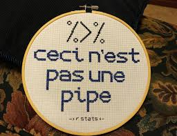

```{r setup, include = FALSE}
# set up global options here
knitr::opts_chunk$set(fig.width = 4, fig.height = 8, fig.path = 'Figs/', 
                      warning = FALSE, message = FALSE, eval = FALSE)
```

Install any of these packages if you don't have them.

```{r load_packages, include = FALSE}
library(dplyr) #for manipulating
library(ggplot2) #for plotting
library(broom) #for dealing with lm output
library(readr) #importing data
library(janitor) #mainly clean_names function
```

Think of this file as your very own sampler:

```{r sampler, eval = TRUE, echo = FALSE}

```


A place for you to save useful R code snippets, notes to yourself, and anything you want to be able to remember the next time you need to conduct a linear regression analysis.

Using our advertising data, suppose we wish to model the linear relationship between the TV budget and sales. 

$$Y = \beta_0 + \beta_1X + \epsilon \tag{1}$$

where:

- Y represents sales
- X represents TV advertising budget
- $\beta_0$ is the intercept
- $\beta_1$ is the coefficient (slope term) representing the linear relationship
- $\epsilon$ is a mean-zero random error term

# Read in the advertising data

```{r}
ad <- read_csv("http://www-bcf.usc.edu/~gareth/ISL/Advertising.csv") %>% 
  clean_names() %>% 
  select(-x1)
```

# Explore dataset

```{r}
# your code goes here
```


# Make a scatterplot

Traditionally, the response variable (Y) goes on the y-axis, and the predictor variable (X) goes on the x-axis.

```{r scatterplot}
adplot <- ggplot( , aes( )) +
  geom_()
adplot
```

Is there a relationship between TV advertising budgets and sales?

[your answer goes here]

# Find the correlation

```{r correlation}
data %>% 
  dplyr?(pearson = cor( , ))
```

Would you quantify the value of correlation calculated above as being:

- strongly positively linear,
- weakly positively linear,
- not linear,
- weakly negatively linear, or
- strongly positively linear?

[your answer goes here]

# Build a linear regression model

```{r model}
admod <- lm(outcome ~ predictor, data = )
```

Print that object by calling `admod`, and use the `summary()` function also. What are you looking at?

```{r}
# your code goes here
```

Note that this output is not very "tidy". What different "sections" of output do you see?

[your answer goes here:]

1. markdown
1. will
1. format this correctly

We'll come back to this topic later.

# Add regression line to scatterplot

You can visualize the linear regression model by adding another geom, `geom_smooth()` to your scatterplot.

```{r plotlm}
adplot + geom_smooth(method = "lm")
```

Note that the gray region shows the confidence interval around the line. Call the help function `?geom_smooth` and figure out how to turn this off:

```{r}
# your code goes here
```

Now see what happens when you take away the `method = "lm"` argument (so there is nothing inside the parentheses).

```{r}
# your code goes here
```

Call the help function `?geom_smooth` and figure out the default setting for the `method` argument. What kind of method is this geom using to create the line you see in the code above?

[your answer goes here]

# Build an intercept-only model and compare models

```{r}
intmod <- lm(outcome ~ 1, data = )
```

Print that object, and use the `summary()` function also. What do you see?

```{r}
# your code goes here
```

[your answer goes here]

Now compare the intercept-only model object to your model that included TV advertising budget as a predictor (`admod`) using the `anova()` function. What do you see? Compare to the output of `summary(admod)`- what do you notice?

```{r}
# your code goes here
```

[your answer goes here]

# Examine the model statistics

Use `broom::glance` to examine the model statistics like $R^2$, the F-statistic, etc. Here, there is one row for each model so it is *tidy*.

```{r}
glance()
```

Go back to the output from the `summary()` function: how does the output of `broom::glance()` differ from that of `summary()`?

[your answer goes here]
 
# Examine the model components

Use `broom::tidy` to examine the model components like coefficients and their p-values. Here, each row corresponds to a coefficient (the intercept term + predictors) so it is *tidy*.

```{r}
tidy()
```

Go back to the output from the `summary()` function: how does the output of `broom::tidy()` differ from that of `summary()`?

[your answer goes here]

# Examine the observations

Use `broom::augment` to examine the observation-level statistics like fitted values, residuals, etc. Here, each row is an observation in the original dataset so it is *tidy*.

```{r}
augment()
```

This probably printed something very long to your console. 

Try piping this output to the `head()` function to see the first 6 rows.

```{r}
# your code goes here
```

Now save the augmented dataframe to a new object called `admod_aug`, and

Challenge! Use the pipe operator to chain a sequence of functions together to:

1) Sort these values by
2) Create a new dataset with values >= 5

```{r}
admod %>% 
  # your code goes here
```


# Plot the residuals


In general you’d like your residuals to looks symmetrically (e.g. approximately Normally) distributed but they aren’t here. Outliers in the residuals aren’t great either.

```{r}
ggplot(, aes(x = , y = ))
```

