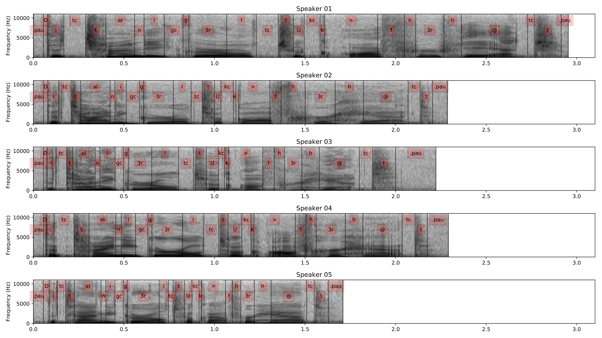

```{r setup, include=FALSE}
options(htmltools.dir.version = FALSE)
knitr::opts_chunk$set(fig.width = 5, fig.height = 4) 
library(ggplot2)
library(tibble)
library(dplyr)
```


# Today

--

- What is "sample data"? 

--

- What does it look like?

--

- How do we describe our sample data?

--

- How do we make "stats" from our sample data?


---
class: center, middle

# What does data look like?

---
class: center, middle


---
class: center, middle


---
class: center, middle


---
class: center, middle


---
class: center, middle



---
class: center, middle


---
class: center, middle

# What does your data look like?

Take 2 minutes

---

# Types of data

.pull-left[
##Categorical
- Nominal (names)
- Ordinal (ordered, but unknown or unequal intervals)
]
.pull-right[
##Quantitative 
- Continuous, consistent intervals)
- Integer
- Real
]

---
class: center, middle

## At some point in the research process, "data" becomes a list of numbers

--

## This list is often very long!

--

  FYI - No one wants to see your list :(

--

## So how do you talk about your data with others?

---
class: center, middle

# Two ways to talk to others about your data

--

## Words

```{asis}
> Overall, 216 tasks (28.2%) contained self talk. Twelve of the sixteen participants, seven younger and five older adults, engaged in self talk at some point in the session. The average rates of self talk for younger and older adults were not significantly different (25.9% and 32.1%, respectively) by Wilcoxon Rank Sum test, z < 1, N.S. As found in study one and illustrated in Figure 4, there were large individual differences in participants’ rate of self talk for both younger adults and elder adults.  
```

--

## Plots

---
# Descriptive statistics - summarizing quantitative data

Measures of location or central tendency
- In general, in what region is the list located on the number line?
- What number is typical of the entire list?
- What number is in the center of the list?

--

Measures of spread or variability
- How far is the list spread out over the number line?

--

Measures of shape
- Pattern of relative interval sizes, moving from left to right


---
class: center

# A simple sample

Data as a list of numbers


```{r}
(x <- c(1, 4, 5, 8, 15))

```


--

```{r echo = FALSE}
n <- 5 # number of obs in sample
s <- 1 # number of samples
sample_tibble <- tibble(x = x, 
                        y = rep(1:s, each = n))
ggplot(sample_tibble, aes(x = x, y = factor(y))) +
  geom_point(colour = "#3498CC", size = 8) +
  geom_text(aes(label = x), nudge_y = 0.1, size = 6) +
  theme_void()
```


---
class: center, middle

# The center

Mode

Median

Mean

---

# The sample mode

The most frequently occurring value in a list

```{r}
# compute the statistical mode of a vector of numbers
stat.mode <- function(x) {
    freqs <- tapply(x, x, length)
    as.numeric(names(freqs)[which.max(freqs)][1])
}
stat.mode(x)
```

NOTE: You don't need to understand the above R function.

---

# The sample median


- Order the numbers from highest to lowest
- If number of numbers is odd, choose the middle
- If number of numbers is even, choose the average of the 2 middle values

```{r}
median(x)
```


```{r echo = FALSE}
ggplot(sample_tibble, aes(x = x, y = factor(y))) +
  geom_point(colour = "#3498CC", size = 8) +
  geom_text(aes(label = x), nudge_y = 0.1, size = 6) +
  geom_segment(aes(x = median(sample_tibble$x[1:5]), # group = 1
                   y = .8, 
                   xend= median(sample_tibble$x[1:5]),
                   yend= 1.2),
               lty = 3) +
  theme_void()
```

---

# The sample mean

The arithmetic mean of the data

$$\bar{x}=\frac{1}{n}\sum_{i=1}^nx_i$$

where $x_1, x_2, x_3, \dots, x_n$ represent the $n$ observed values.

--

Number with the smallest sum of *squared* distances to the list of numbers

--

Hence, the mean is a *least squares estimator*

--

Unless ALL scores are identical, most if not all, scores will be different from the mean.

---
class: middle, center

# The sample mean

```{r}
x <- c(1, 4, 5, 8, 15)
mean(x)
```

```{r echo = FALSE}
ggplot(sample_tibble, aes(x = x, y = factor(y))) +
  geom_point(colour = "#3498CC", size = 8) +
  geom_text(aes(label = x), nudge_y = 0.1, size = 6) +
  geom_segment(aes(x = mean(sample_tibble$x[1:5]), # group = 1
                   y = .8, 
                   xend= mean(sample_tibble$x[1:5]),
                   yend= 1.2),
               lty = 3) +
  theme_void()
```


---
class: center, middle

# The spread

Standard deviation/variance

Median absolute deviation

Interquartile range

Min-to-max range

---
class: center
# Variance and Standard deviation 

$$variance = s^2 = \frac{1}{n-1} \sum_{i=1}^n (x_i - \bar{x})^2 $$

$$sd  = s = \sqrt{s^2} $$

```{r}
x <- c(1, 4, 5, 8, 15)
sd(x)
```
???

-Measure of how far the data, as a whole, falls from the mean

-Talk about width  - draw two pictures

-How sure are you about that mean?


---

# Z-score

$$z_i = \frac{x_i - \bar{x}}{s} $$

--
- Represents each data point as it's distance from the dataset mean, in terms of standard deviations
- Transformed dataset: sd = 1 and mean = 0
- Reversible


```{r}
z <- (x-mean(x))/sd(x)
round(mean(z),0)
sd(z)
```
--
- Critical data transformation in statistics - the basis for the _standard normal distribution_
- Warning!! Does not result in a _normal_ distribution unless the dataset was normal

---

# Shape 

- Modality [think: mounds]

--

- Skewness [think: symmetry]

--

- Kurtosis [think: peakedness]

---
class: center

# Modality


---

# Skewness

Skewness statistics provide information about departures from symmetry

--

Draws on all 3 measures of location

--

The standard definition of skewness in a population is the average cubed z-score

--


---


# Calculating skewness

Here is one way to calculate skewness, using the formula for the adjusted Fisher-Pearson standardized moment coefficient, $G_1$:

$$G_1 = \frac{n}{(n-1)(n-2)}\sum_{i=1}^n {\frac{(x_i - \bar{x})^3}{s^3}}$$


```{r}
g1_calculate <- function(x = data){
  s3.x <- sum((x-mean(x))^3/sd(x)^3) # right side of eq
  n <- length(x)
  g1 <- (n/((n-1)*(n-2)))*s3.x
  return(g1)
}

g1_calculate(x)
g1_calculate(scale(x)) #scale is one way to create a z-score
```

?? If the data have high skewness (due to "long" tails), what does that say about the sample mean and variance/sd ??

---
# Calculating skewness in R
```{r}
# install.packages("moments")
library(moments)
skewness(x)
skewness(scale(x))
```


---

# Kurtosis

$$K = n*\frac{\sum_{i=1}^n{(x_i - \bar{x})^4}} {(\sum_{i=1}^n{(x_i - \bar{x})^2)^2}}$$


The basic idea of kurtosis is that it is the average 4th power of the z-scores
Kurtosis of a distribution is typically expressed relative to that of a normal distribution.

--

The normal distribution has a kurtosis of 3. So, the most common measure of kurtosis is the average 4th power of the z-scores minus 3.

--

This can be computed in a number of ways. The simplest version is biased for a normal distribution, but is reported by some programs.

--

?? If the data have high kurtosis (due to "heavy" tails), what does that say about the sample mean and variance/sd ??

---

# Calculating kurtosi4

```{r}
s4.x <- sum((x-mean(x))^4) #using raw
s2.x <- sum((x-mean(x))^2) #using raw
n <- length(x)
n*s4.x/s2.x^2
z.x <- (x - mean(x))/sd(x) #makes z-scores using x
s4.z <- sum((z.x-mean(z.x))^4) #using z
s2.z <- sum((z.x-mean(z.x))^2) #using z
n*s4.z/s2.z^2

kurtosis(x)
```

---
#Some intuitions about stats

To the board!

- Confidence Intervals

- Linear Modeling

- Comparing samples

???
Talk about clasical vs computer vs ML

CI - what would happen if I sampled a bunch?

Modeling
  - whats a good model
    - indedendent vars (more? less? 2 have same effect)
    - fit (sloped, flat close, messy)

Comparing  
  - need the same shape, thus why we worry about transformations
  - Most of what we'll do is based on the glm
  - z-test. t-test. anova, chi-square
