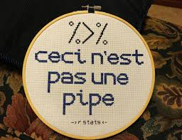

```{r setup, include = FALSE}
# set up global options here
knitr::opts_chunk$set(fig.width = 4, fig.height = 8, fig.path = 'Figs/', 
                      warning = FALSE, message = FALSE, eval = FALSE)
```

Install any of these packages if you don't have them.

```{r load_packages, include = TRUE}
library(readr) #importing data
library(janitor) #mainly clean_names function
library(dplyr) #for manipulating data
library(ggplot2) #for plotting
library(broom) #for dealing with lm output
```

Your very own linear regression sampler:

```{r sampler, eval = TRUE, echo = FALSE}

```


A place for you to save useful R code snippets, notes to yourself, and anything you want to be able to remember the next time you need to conduct a linear regression analysis.

Using our advertising data, suppose we wish to model the linear relationship between the TV budget and sales. 

$$Y = \beta_0 + \beta_1X + \epsilon \tag{1}$$

where:

- Y represents sales
- X represents TV advertising budget
- $\beta_0$ is the intercept
- $\beta_1$ is the coefficient (slope term) representing the linear relationship
- $\epsilon$ is a mean-zero random error term

NOTE: equations are auto numbered!

# Read in the advertising data

```{r read_csv}
ad <- read_csv("http://faculty.marshall.usc.edu/gareth-james/ISL/Advertising.csv") %>% 
  clean_names() %>% 
  select(-x1)
# Look at the object in the Environment tab - Why the "cols()" output?
```


# Explore dataset

```{r view_raw}
# SO many options
glimpse(ad)
head(ad)
tail(ad, n=10)
skimr::skim(ad) #What's with the '::'
```


# Make a scatterplot

Traditionally, the response variable (Y) goes on the y-axis, and the predictor variable (X) goes on the x-axis.

```{r scatterplot}
adplot <- ggplot(ad,aes(x=tv, y=sales)) +
  geom_point() 
adplot

# What if I don't specifiy the variables in aes()? What if no "geom_?"
```

Is there a relationship between TV advertising budgets and sales?

[your answer goes here]

# Find the correlation

```{r correlation}
ad %>% 
  dplyr::summarize(pearson = cor(sales,tv))
```

Would you quantify the value of correlation calculated above as being:

- strongly positively linear,
- weakly positively linear,
- not linear,
- weakly negatively linear, or
- strongly positively linear?

[your answer goes here]

# Add regression line to scatterplot

You can visualize the linear regression model by adding another geom, `geom_smooth()` to your scatterplot.

```{r plotlm}
adplot + geom_smooth(method = "lm")
```

Note that the gray region shows the confidence interval around the line. Call the help function `?geom_smooth` and figure out how to turn this off:

```{r}
# your code goes here
adplot + geom_smooth(se=FALSE)
```

Now see what happens when you take away the `method = "lm"` argument (so there is nothing inside the parentheses).

```{r loess}
adplot <- ggplot(ad,aes(x=tv, y=sales)) +
  geom_point() + 
  geom_smooth()
adplot
```

Call the help function `?geom_smooth` and figure out the default setting for the `method` argument. What kind of method is this geom using to create the line you see in the code above?

[your answer goes here]

# Build a linear regression model

```{r model}
admod <- lm(sales ~ tv, data = ad)
```

Print that object by calling `admod`, and use the `summary()` function also. What are you looking at?

```{r}
summary(admod)
```

Note that this output is not very "tidy". What different "sections" of output do you see?

[your answer goes here:]

1. formula
1. Residuals
1. Coefficients
1. Model level statistics

We'll come back to this topic later.


# Examine the model statistics

Use `broom::glance` to examine the model statistics like $R^2$, the F-statistic, etc. Here, there is one row for each model so it is *tidy*.

```{r}
glance(admod)
```

Go back to the output from the `summary()` function: how does the output of `broom::glance()` differ from that of `summary()`?

[your answer goes here]
 
# Examine the model components

Use `broom::tidy` to examine the model components like coefficients and their p-values. Here, each row corresponds to a coefficient (the intercept term + predictors) so it is *tidy*.

```{r}
tidy(admod)
```

Go back to the output from the `summary()` function: how does the output of `broom::tidy()` differ from that of `summary()`?

[your answer goes here]

# Examine the observations

Use `broom::augment` to examine the observation-level statistics like fitted values, residuals, etc. Here, each row is an observation in the original dataset so it is *tidy*.

```{r}
augment(admod)
```

This probably printed something very long to your console. 

Try piping this output to the `head()` function to see the first 6 rows.

```{r}
augment(admod) %>% 
  head()# your code goes here
```

Now save the augmented dataframe to a new object called `admod_aug`

```{r}
admod_aug <- admod %>%
  augment()
      # your code goes here
```


# Plot the residuals


In general you’d like your residuals to look symmetrically distributed (e.g. approximately Normally).

```{r}
ggplot(admod_aug, aes(x = tv, y = .resid)) +
  geom_point()
```

But they aren’t in this case. Outliers in the residuals aren’t great either.
What do you think? Is this a good candidate for linear regression? 

Another way to see the relationship
```{r autoplot}
library(ggfortify)
autoplot(admod)

# Notice the x-axis on the first chart. Above we put `tv` on the x-axis. 
# Why are both ways reasonable?
```


# If we have time:

1. Compute the SS's
1. Compute $R^2$
1. glance the linear model - do the $R^2$ values match?
1. Describe what the $R^2$ tells us.


```{r}
admod_aug %>% 
  summarize(SST = sum((sales - mean(sales))^2),
         SSR = sum((sales - .fitted)^2),
         SSM = sum((.fitted - mean(sales))^2),
         R2 = SSM/SST
         )
glance()

```

[your answer here]


# Build an intercept-only model and compare models

```{r}
intmod <- lm(sales ~ 1, data = ad)
```

Print that object, and use the `summary()` function also. What do you see?

```{r}
# your code goes here
intmod
summary(intmod)
```

[your answer goes here]

Now compare the intercept-only model object to your model that included TV advertising budget as a predictor (`admod`) using the `anova()` function. What do you see? Compare to the output of `summary(admod)`- what do you notice?

```{r}
# your code goes here
anova(intmod, admod) #The model with fewer predictors goes first
summary(admod)
```

[your answer goes here]
