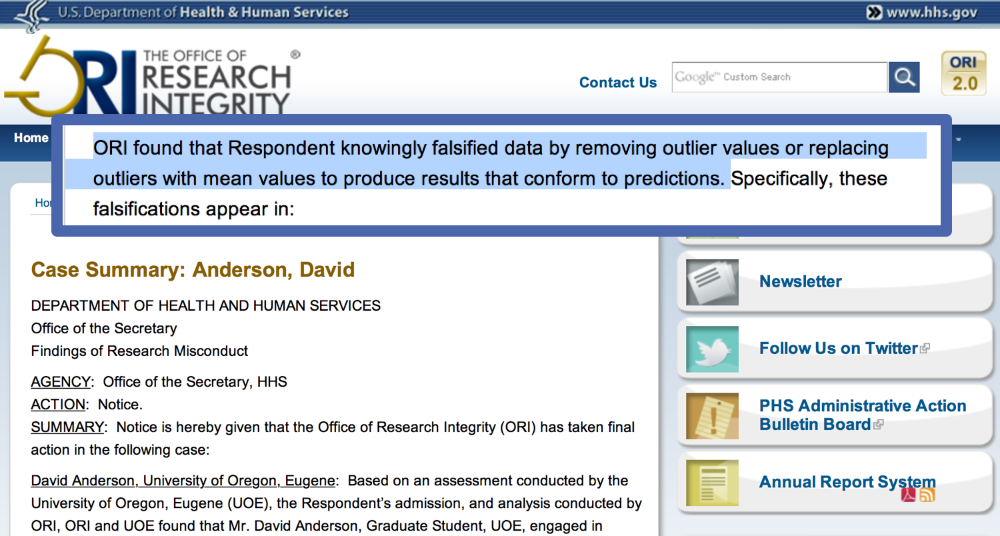
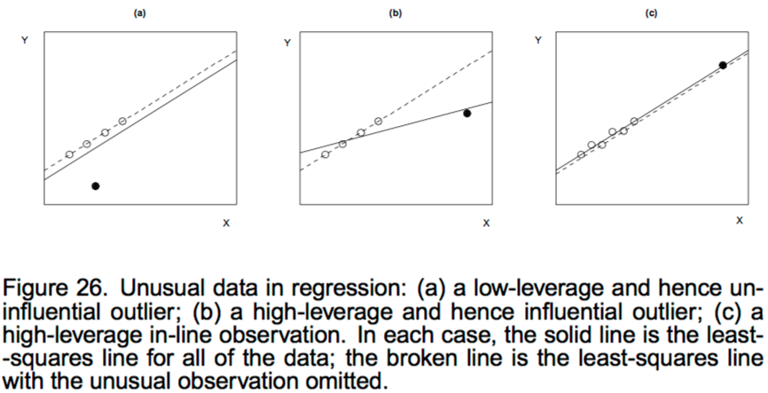

```{r notes, include=FALSE}
#This slide deck combines CONJ cm025, cm026 (not ont the CONJ CM page), and the cm025 in-class lab.
```


```{r setup, include=FALSE}
# leave this chunk alone
options(knitr.table.format = "html") 
knitr::opts_chunk$set(warning = FALSE, message = FALSE, 
  comment = NA, dpi = 300, out.width = '60%')
```

```{r packages, echo=FALSE, message=FALSE, warning=FALSE}
library(tidyverse)
library(moderndive)
library(extrafont)
library(broom)
library(GGally) 
library(skimr)
library(fivethirtyeight) 
library(ggfortify)
```


## Packages

```{r load_packages, eval = FALSE}
library(fivethirtyeight) 
library(moderndive)
library(skimr)
library(tidyverse)
library(GGally) 
library(broom)
```

---
## Data

```{r}
glimpse(hate_crimes)
```


---
## Pre-processing

```{r}
hate_demo <- hate_crimes %>%
  select(state, avg_hatecrimes_per_100k_fbi, share_pop_hs, gini_index, share_vote_trump) %>%
  mutate(
    cat_trump = case_when(
      share_vote_trump < .5 ~ "less than half", 
      TRUE ~ "more than half"
      )) %>% 
  mutate(cat_trump = as.factor(cat_trump)) %>% 
  select(-share_vote_trump)
```

---
class: middle, center, inverse

## Your turn

As groups, discuss your model output: 

(1) look at the regression table, and 

(2) attempt to interpret the three values that define the regression plane


---
## Model 1: Two numerical predictors

```{r}
hate_two <- lm(avg_hatecrimes_per_100k_fbi ~ 
                   gini_index + 
                   share_pop_hs,
                 data = hate_demo)

get_regression_table(hate_two)
```


---
class: center, middle
## Model 1: Two numerical predictors

$$\widehat{\textrm{avg_crimes}} = -54 + 64.3*\textrm{gini_index} + 31.3*\textrm{share_pop_hs}$$
<br>
--
Is this interpretable? 


<br>
--
Intuitive?


```{r echo = FALSE}
#knitr::include_graphics("images/lm-whiteboard-process.jpg")
```

---
## Model 1: Two numerical predictors: centered


```{r Model2_c}
hate_two_c <- lm(avg_hatecrimes_per_100k_fbi ~ 
                   I(gini_index-mean(gini_index)) + 
                   I(share_pop_hs-mean(share_pop_hs)),
                 data = hate_demo)

get_regression_table(hate_two_c)
```

Centered: $\widehat{\textrm{avg_crimes}} = 2.36 + 64.3*\textrm{centred(gini_index)} + 31.3*\textrm{centered(share_pop_hs)}$

Raw: $\widehat{\textrm{avg_crimes}} = -54 + 64.3*\textrm{gini_index} + 31.3*\textrm{share_pop_hs}$

---
## Model 1: Two numerical predictors: z-scores

```{r Model2_z}
hate_two_z <- lm(avg_hatecrimes_per_100k_fbi ~ 
                   scale(gini_index) + 
                   scale(share_pop_hs),
                 data = hate_demo)

get_regression_table(hate_two_z)
```
z-scored: $\widehat{\textrm{avg_crimes}} = 2.36 + 1.34*\textrm{scaled(gini_index)} + 1.07*\textrm{scaled(share_pop_hs)}$

Centered: $\widehat{\textrm{avg_crimes}} = 2.36 + 64.3*\textrm{centred(gini_index)} + 31.3*\textrm{centered(share_pop_hs)}$

Raw: $\widehat{\textrm{avg_crimes}} = -54 + 64.3*\textrm{gini_index} + 31.3*\textrm{share_pop_hs}$


---
## Model 1: Two numerical predictors
<!-- Raw: $\widehat{\textrm{avg_crimes}} = -54 + 64.3~ \textrm{gini_index} + 31.3~\textrm{share_pop_hs}$ -->

<!-- Centered: $\widehat{\textrm{avg_crimes}} = 2.36 + 64.3~ \textrm{centred(gini_index)} + 31.3~\textrm{centered(share_pop_hs)}$ -->

<!-- z-score: $\widehat{\textrm{avg_crimes}} = 2.36 + 1.34~ \textrm{scaled(gini_index)} + 1.07~\textrm{scaled(share_pop_hs)}$ -->

```{r transformed_model_comparisons}
broom::glance(hate_two)
broom::glance(hate_two_c)
broom::glance(hate_two_z)
```

---
## Model 2: Parallel slopes

```{r}
hate_para <- lm(avg_hatecrimes_per_100k_fbi ~ 
                   gini_index + 
                   cat_trump,
                 data = hate_demo)

get_regression_table(hate_para)
```

```{r include = FALSE}
para_pts <- get_regression_points(hate_para)
para_pts %>% 
  summarize(var_resid = var(residual),
            se_resid = sd(residual))
```

```{r include = FALSE}
hate_minus <- lm(avg_hatecrimes_per_100k_fbi ~ 
                   gini_index + 
                   cat_trump,
                 data = filter(hate_demo, !state == "District of Columbia"))
#get_regression_table(hate_minus)
minus_pts <- get_regression_points(hate_minus)
minus_pts %>% 
  summarize(var_resid = var(residual),
            se_resid = sd(residual))
```

---
## Model 2: Parallel slopes

$$\widehat{\textrm{avg_crimes}} = -12.1 + 32.5*\textrm{gini_index} - 0.51*\textrm{cat_trump}$$


```{r echo = FALSE}
knitr::include_graphics("images/lm-whiteboard-process.jpg")
```


---
## Model 2: Parallel slopes

```{r echo = FALSE}
coeff <- lm(avg_hatecrimes_per_100k_fbi ~ 
                   gini_index + 
                   cat_trump,
                 data = hate_demo) %>% 
  coef() %>%
  as.numeric()
slopes <- hate_demo %>%
  group_by(cat_trump) %>%
  summarise(min = min(gini_index), 
            max = max(gini_index)) %>%
  mutate(intercept = coeff[1]) %>%
  mutate(intercept = ifelse(cat_trump == "less than half", intercept + coeff[3], intercept)) %>%
  gather(point, gini_index, -c(cat_trump, intercept)) %>%
  mutate(y_hat = intercept + gini_index * coeff[2])

ggplot(hate_demo, aes(x = gini_index, y = avg_hatecrimes_per_100k_fbi, col = cat_trump)) +
  geom_jitter() +
  labs(x = "gini index", y = "hate crimes", color = "trump") +
  geom_line(data = slopes, aes(y = y_hat), size = 1) +
  theme_minimal()
```

---
## Model 3: Interaction model

```{r}
hate_int <- lm(avg_hatecrimes_per_100k_fbi ~ 
                   gini_index* 
                   cat_trump,
                 data = hate_demo)

get_regression_table(hate_int)
```

---

## Model 3: Interaction model

$$\widehat{\textrm{avg_crimes}} = -20.4 + 50.6*\textrm{gini_index} + 25.7*\textrm{cat_trump} -57.9*\textrm{(gini_index)(cat_trump)}$$
```{r echo = FALSE}
knitr::include_graphics("images/lm-whiteboard-3models.jpg")
```

---
## Model 3: Interaction model

$$\widehat{\textrm{avg_crimes}_{trump=1}} = 5.3 - 7.3*\textrm{gini_index}$$

$$\widehat{\textrm{avg_crimes}_{trump=0}} = -20.4 + 50.6*\textrm{gini_index}$$

```{r echo = FALSE}
knitr::include_graphics("images/lm-whiteboard-3models.jpg")
```

---

## Visualize interaction model


```{r echo = FALSE}
ggplot(hate_demo, aes(x = gini_index, 
                      y = avg_hatecrimes_per_100k_fbi,
                      color = cat_trump)) +
  geom_point() +
  geom_smooth(method = "lm", se = FALSE) +
  facet_wrap(~cat_trump) +
  theme_minimal() +
  guides(color=FALSE)
```


---
## Model 3: Center predictors

Would this be easier to interpret after centering the predictor `gini_index`?

$$\widehat{\textrm{avg_crimes}_{trump=1}} = 1.98 - 7.3*\textrm{gini_index}$$

$$\widehat{\textrm{avg_crimes}_{trump=0}} = 2.54 + 50.6*\textrm{gini_index}$$

```{r echo = FALSE}
hate_int <- lm(avg_hatecrimes_per_100k_fbi ~ 
                   I(gini_index - mean(gini_index))* 
                   cat_trump,
                 data = hate_demo)

get_regression_table(hate_int)
```


---
## Model 3: Center predictors

```{r echo = FALSE}
ggplot(hate_demo, aes(x = (gini_index - mean(gini_index)), 
                      y = avg_hatecrimes_per_100k_fbi,
                      color = cat_trump)) +
  geom_point() +
  geom_smooth(method = "lm", se = FALSE) +
  facet_wrap(~cat_trump) +
  theme_minimal() +
  guides(color=FALSE)
```

---
## Model 4: Continuous interaction

```{r}
hate_cont <- lm(avg_hatecrimes_per_100k_fbi ~ 
                   gini_index * 
                   share_pop_hs,
                 data = hate_demo)

get_regression_table(hate_cont)
```

<br>
--
**What??**

---
## Model 4: Continuous interaction

```{r}
get_regression_table(hate_cont)
broom::glance(hate_cont)
```

--
  Collinearity?
--

  - Overall model works "well", but the predictors do not.

--
  - SE's are large.

--
  - We put it there!

--
Confused variance!


---
## Model 4: Continuous interaction - Collinearity


```{r continuous_int_model_z}
hate_cont_z <- lm(avg_hatecrimes_per_100k_fbi ~ 
                   scale(gini_index) * 
                   scale(share_pop_hs),
                 data = hate_demo)

```

```{r echo=FALSE}
get_regression_table(hate_cont_z)
broom::glance(hate_cont_z)

```

---
## Model 4: Continuous interaction

Is the interaction needed?

_With interaction term_:
$$\widehat{\textrm{avg_crimes}} = 2.47 + 1.29~ \textrm{scaled(gini_index)} + 1.04~\textrm{scaled(share_pop_hs)}$$
$$+ .171~\textrm{scaled(gini_index)}*\textrm{scaled(share_pop_hs)}$$
_Without_:
$$\widehat{\textrm{avg_crimes}} = 2.36 + 1.34~ \textrm{scaled(gini_index)} + 1.07~\textrm{scaled(share_pop_hs)}$$

_Comparing_:
```{r}
anova(hate_cont,hate_two_z)
```

---
class: middle, inverse, center


---
## Contaminated observation or special snowflake?

* A **contaminated observation** is one that has been damaged in some way. Some examples:
    * Error of execution of the research procedure.
    * Inaccurate measurement of the dependent measure. 
    * Data entry error.
    * Error in calculating a measure.
    * Non-attentive or distracted participants.
* The outlier may simply be an **extremely rare case**. For example, a college freshman might be 12 years old and have an 800
SAT in math. Such an individual is extremely rare, but data is valid.

---
class: middle, inverse, center


---
class: middle, inverse, center



---
## Definitions

> "Unusual data are problematic in linear models fit by least squares because they can unduly influence the results of the analysis, and because their presence may be a signal that the model fails to capture important characteristics of the data."

* An **outlier** is an observation whose response-variable value is conditionally unusual given the values of the explanatory variables.
* In contrast, a **univariate outlier** is a value of $y$ or $x$ that is unconditionally unusual; such a value may or may not be a regression outlier.

from [John Fox](https://socialsciences.mcmaster.ca/jfox/Courses/Brazil-2009/slides-handout.pdf)

---


---
## Types of influence


* Extremity on the x’s (leverage)
* Extremity on y (discrepancy)
* Influence on the regression estimates 
    * Global
    * Specific coefficients
    
---
## Extremity on the `x`: leverage

* Standardized measure of how far the observed value for each observation is from the mean value on the set of `x` values
* Observations with high leverage have the potential to be influential, especially if also extreme on `y`
* The response-variable values are not at all involved in calculating leverage.

---
## Leverage - using hat

* Measure of how unusual the `x` value of a point is, relative to the `x` observations as a whole; leverage describes how unusual an observation is in predictor(s) data.
<!-- * $1/n \leq h_i \leq 1$.  -->
* If $h_{i}$ is large then the $i$th observation has considerable impact on the fitted value

SLR:
$$h_{i} = \frac{1}{n} + \frac{{\left(x_{i} - \bar{x}\right)}^2}{\sum_{i=1}^{n}x_i^2}$$
MLR:
```{r}
lm_swiss <- lm(Agriculture ~ Examination, swiss)
design_matrix <- model.matrix(lm_swiss)
X <- design_matrix
OLS_estimator <- MASS::ginv(t(X) %*% X) %*% t(X) 
hat_matrix <- X %*% OLS_estimator 

hat <- diag(hat_matrix)    # The hat matrix
num_parameters <- sum(hat) # Number of parameters, including the intercept
y_hat <- hat_matrix %*% swiss$Agriculture
```

---
## Start with one model

I'll choose the parallel slopes model

```{r}
hate_mod <- lm(avg_hatecrimes_per_100k_fbi ~ 
                   gini_index + 
                   cat_trump,
                 data = hate_demo)

get_regression_table(hate_mod)
```

---
## Diagnostic data frame

Use `data` argument to merge original data with diagnostics!
From [https://github.com/tidymodels/broom/issues/91](https://github.com/tidymodels/broom/issues/91)

```{r}
hate_mod <- lm(avg_hatecrimes_per_100k_fbi ~ 
                   gini_index + cat_trump, data = hate_demo)

hate_diag <- broom::augment(hate_mod, data = hate_demo) 

glimpse(hate_diag)
```

---
## Leverage

```{r}
hate_diag %>% 
  select(state, .hat) %>%
  arrange(desc(.hat))
```

---
## Leverage 

[Rules of thumb from John Fox](https://socialsciences.mcmaster.ca/jfox/Courses/Brazil-2009/slides-handout.pdf)

```{r}
k <- 2 # Number of predictors
mean_hat <- (k + 1)/nrow(hate_demo)
# "large" samples
hate_diag %>% 
  select(state, .hat) %>%
  filter(.hat > (2*mean_hat))
```

```{r}
# "small" samples
hate_diag %>% 
  select(state, .hat) %>%
  filter(.hat > (3*mean_hat))
```

---
## Plot leverage against `x`

```{r out.width= '70%', echo = FALSE}
ggplot(hate_diag, aes(x = gini_index, y = .hat)) +
  geom_point() +
  geom_line(aes(y = 2*mean_hat), colour = "red", lty = "dashed") +
  geom_line(aes(y = 3*mean_hat), colour = "slateblue", lty = "dashed") +
  geom_text(aes(label = state), size = 2, vjust = 2) +
  theme_minimal()
```

---
## Plot leverage against `x`

```{r out.width= '70%', echo = FALSE}
ggplot(hate_diag, aes(x = gini_index, y = .hat)) +
  geom_point() +
  geom_line(aes(y = 2*mean_hat), colour = "red", lty = "dashed") +
  geom_line(aes(y = 3*mean_hat), colour = "slateblue", lty = "dashed") +
  geom_text(aes(label = state), size = 2, vjust = 2) +
  theme_minimal() +
  facet_wrap(~cat_trump)
```

---
class: middle, inverse, center
## Your turn

With your model, use `broom::augment()` to find observations with high leverage 


---
## Extremity on `y`: discrepancy

* The discrepancy (or $distance^2$) between each predicted and observed value of $y_{i}$
* A studentized residual is an observed residual divided by its standard error; two types:
    * Internally studentized (`rstandard`): re-normalize the residuals to have unit variance, using a measure of the error variance.
    * Also `broom::.std.resid`
* Externally studentized (`rstudent`): re-normalize the residuals to have unit variance, using a leave-one-out measure of the error variance. This is a measure of the size of the residual, standardized by the estimated standard deviation of residuals based on all the data `but that observation`. Sometimes called jackknifed residuals.
---

###Additional notes on discrepancy:

* High-leverage observations tend to have small residuals, because these observations can coerce the regression surface to be close to them.
* The formula for the studentized residual is:

$$t_{i}={\widehat {\varepsilon }_{i} \over \widehat {\sigma }{\sqrt  {1-h_{{ii}}\ }}}$$

* For internally studentized residuals, $\widehat{\sigma}^2$ is calculated as:

$$\widehat{\sigma}^2={1 \over n-m}\sum_{j=1}^n \widehat{\varepsilon}_j^{\,2}$$

* For externally studentized residuals, $\widehat{\sigma}_{(i)}^2$ is calculated as:

$$\widehat{\sigma}_{(i)}^2={1 \over n-m-1}\sum_{\begin{smallmatrix}j = 1\\j \ne i\end{smallmatrix}}^n \widehat{\varepsilon}_j^{\,2}$$
---
## Internally studentized residuals

.pull-left[
```{r}
hate_diag %>% 
  select(state, .std.resid) %>% 
  arrange(.std.resid) %>% 
  slice(1:5)
```
]

.pull-right[
```{r}
hate_diag %>% 
  select(state, .std.resid) %>% 
  arrange(desc(.std.resid)) %>% 
  slice(1:5)
```
]

---
## Externally studentized residuals

* `rstudent`
* Sadly, not available in `broom::augment`

```{r}
hate_diag <- hate_diag %>% 
  mutate(.ext.resid = rstudent(hate_mod)) # add 

hate_diag %>% 
  select(state, .std.resid, .ext.resid) %>% 
  arrange(desc(.ext.resid)) %>% 
  slice(1:5)
```

---
## Expect 5% are 2+

```{r}
hate_diag %>%
  filter(abs(.ext.resid) >= 2) %>%
  select(state, gini_index, .resid, .std.resid, .ext.resid)
```

2 out of 51 are high:
3.9% of observations with ESR considered to be relatively large
(expected ≈ 2 or 3 observations)

<!-- --- -->
<!-- class: middle, inverse, center -->
<!-- ## Your turn -->

<!-- With your model, find observations with high externally studentized residuals (and thus high discrepancy), and compare to the raw residual value, and the internally studentized residual value. What do you notice? -->

---
class: middle, inverse, center
## Your turn 

A common heuristic: 

Influence on Coefficients = Leverage × Discrepancy

Do you have any observations with both high leverage and high discrepancy?

---
###Leverage and Discrepancy

```{r plot_leverageXdiscrepancy, echo = FALSE}
ggplot(hate_diag, aes(x=.hat, y=.ext.resid)) +
  geom_point() +
  geom_text(aes(label=state)) +
  geom_line(y=-2, color="red", lty="dashed") +
  geom_line(y= 2, color="blue", lty="dashed") +
  geom_line(aes(x = 2*mean_hat), colour = "red", lty = "dashed") +
  geom_line(aes(x = 3*mean_hat), colour = "slateblue", lty = "dashed")

```

---
class: middle, inverse, center

## Influence on regression estimates

---
## Cook's distance

Global influence

* Influence on regression line, measured by how much the regression line would change if the point were not included in the analysis.
* Cook's distance measures the influence of case $i$ on all $n$ fitted values $y_i$ 
* Cook's distance refers to how far, on average, predicted $\hat{y_i}$ values will move if the observation in question is dropped from the data set


---
## Cook's distance

```{r}
n <- nrow(hate_demo)
k <- 2 # predictors (not including intercept)
d <- 4/(n - k - 1)
d
```

```{r}
hate_diag %>%
  filter(.cooksd > d) %>% 
  select(state, avg_hatecrimes_per_100k_fbi, .cooksd)
```

---
## Plot leverage versus Cook's D

```{r echo=FALSE}
ggplot(hate_diag, aes(x = .hat, y = .cooksd)) + 
  geom_point() +
  geom_text(aes(label = state), size = 3, vjust = 2) + 
  geom_line(aes(y = d), colour = "red", lty = "dashed")
```

---
## Plot leverage versus discrepancy, and Cook's D

```{r echo=FALSE}
ggplot(hate_diag, aes(x = .hat, y=.ext.resid, size = .cooksd)) + 
  geom_point() +
  geom_text(aes(label = state), size = 3, vjust = 2)
```
---
## Parallel slopes with and without DC

```{r echo = FALSE}
coeff_minus_dc <- lm(avg_hatecrimes_per_100k_fbi ~ 
                   gini_index + 
                   cat_trump,
                 data = filter(hate_demo, !state == "District of Columbia")) %>% 
  coef() %>%
  as.numeric()

slopes_minus_dc <- hate_demo %>%
  filter(!state == "District of Columbia") %>% 
  group_by(cat_trump) %>%
  summarise(min = min(gini_index), 
            max = max(gini_index)) %>%
  mutate(intercept = coeff_minus_dc[1]) %>%
  mutate(intercept = ifelse(cat_trump == "less than half", intercept + coeff_minus_dc[3], intercept)) %>%
  gather(point, gini_index, -c(cat_trump, intercept)) %>%
  mutate(y_hat = intercept + gini_index * coeff_minus_dc[2])

ggplot(hate_demo, aes(x = gini_index, y = avg_hatecrimes_per_100k_fbi, col = cat_trump)) +
  geom_jitter() +
  labs(x = "gini index", y = "hate crimes", color = "trump") +
  geom_line(data = slopes, aes(y = y_hat), size = 1) +
  geom_line(data = slopes_minus_dc, aes(y = y_hat), size = 1, lty = "dotted") +
  theme_minimal() +
  facet_wrap(~cat_trump)
```

---
## Interaction model with and without DC

```{r echo = FALSE}
ggplot(hate_demo, aes(x = gini_index, 
                      y = avg_hatecrimes_per_100k_fbi,
                      color = cat_trump)) +
  geom_point() +
  geom_smooth(method = "lm", se = FALSE) +
  facet_wrap(~cat_trump) +
  theme_minimal() +
  guides(color=FALSE) +
  geom_smooth(data = filter(hate_demo, !state == "District of Columbia"),
              aes(x = gini_index, y = avg_hatecrimes_per_100k_fbi, color = cat_trump), 
              method = "lm", se = FALSE, lty = "dotted")
```

---
## Specific measures of influence - DFBETAS

* How each individual regression coefficient is changed by deleting each case from the dataset
* Number of DFBETAS is the number of predictors in your model
* Also for the intercept- generally not interesting one bit!
* Recommendation: I would look at DFBETAS after Cook’s to isolate which explantory variables might be unduly influencing your overall regression equation

```{r}
hate_betas <- hate_diag %>% 
  cbind(dfbetas(hate_mod))
```


---
## Summing up diagnostics

```{r include = FALSE}
diag_table <- tibble::tribble(
  ~Influence, ~Index, ~Function,
  "Leverage", "Hat values", ".hat from broom::augment",
  "Discrepancy", "Externally studentized residual", "rstudent(model) within mutate",
  "Global influence", "Cook's d", ".cooksd from broom::augment",
  "Specific influence", "DFBETAS", "dfbetas(model)"
)
```


```{r echo = FALSE, results = 'asis'}
knitr::kable(diag_table, format = "html")
```


---

##How to read autoplot

```{r}
library(ggfortify)
autoplot(hate_mod, label.size = 3)
```

---
##How to read autoplot

The plot in the _upper left_ shows the residual errors plotted versus their fitted values. 

The residuals should be randomly distributed around the horizontal line representing a residual error of zero; that is, there should not be a distinct trend in the distribution of points.

```{r my_autoplot, echo=FALSE}
my_autoplot <- autoplot(hate_mod, label.size = 4)
#my_autoplot[1,]
```

---
##How to read autoplot output

The plot in the _upper right_ is a Normal Q-Q plot, which should suggest that the residual errors are normally distributed.
```{r my_autoplot_Q, echo=FALSE}
#my_autoplot[2,]
```


A Q-Q plot displays quantiles of one distribution against quantiles of another. What this means is that the data are ranked and sorted.

* A normal Q-Q plot displays quantiles of the normal distribution on the *x*-axis against quantiles of the empirical (i.e., the observed) distribution on the *y*-axis.
* A straight line is typically plotted through the points corresponding to the 1st and 3rd quantiles of each variable. If the empirical data is normally distributed, all the points on the normal Q-Q plot will form a perfectly straight line.

---
##Q-Q plots

```{r include = FALSE}
diag_table <- tibble::tribble(
  ~"Description of Point Pattern", ~"Possible Interpretation",
"all but a few points fall on line",
"outliers in the data",
"left end sags below line; right end lifts above line",
"long tails at both ends of the data distribution",
"left end lifts above line; right end sags below line",
"short tails at both ends of the data distribution",
"curved pattern with increasing slope (L to R)",
"data distribution is skewed to the right",
"curved pattern with decreasing slope (L to R)",
"data distribution is skewed to the left",
"staircase pattern (plateaus and gaps)",
"data have been rounded or are discrete")
```


```{r echo = FALSE, results = 'asis'}
knitr::kable(diag_table, format = "html")
```

---
##How to read autoplot output

The plot in the _lower right_ shows each observation's leverage and standardized residuals. 

Here we don't want to see extreme points in the upper right.

---
##How to read autoplot output

The scale-location plot in the _lower left_ shows the square root of the standardized residuals (sort of a square root of relative error) as a function of the fitted values. 

Again, there should be no obvious trend in this plot.

---
# RMSE

  * The root mean square error for regression says how far typical points are above or below the regression line. 
  * The RMSE is to the regression line as the SD is to the average. 
  * For instance, if the scatter diagram is football-shaped,
about 68% of the points on the scatter diagram will be within one RMSE of the regression
line, about 95% of then will be within 2 RMSE of the regression line.
  * The advantage of RMSE metric is that it is more "normalized". Specifically, SSE will increase depending on the amount of the data. 
  * The MSE would not depend on the amount of the data, but the RMSE also expresses the error in the same units as y.

```{r include = FALSE, eval = FALSE}
# Mean squared error
d_diag <- hate_diag %>% 
  summarize(mse = mean(.resid^2),
            rmse = sqrt(mse),
            rss = sum(.resid^2))

# Root mean squared error
rmse <- sqrt(mse)

# Residual sum of squares
rss <- sum(residuals(fit)^2)

## Proportion of values contained between 1 RMSE
print(mean(abs(ehat) < RMSE))
## [1] 0.7133581
## Proportion of values contained between 2 RMSEs
print(mean(abs(ehat) < 2 * RMSE))
```
