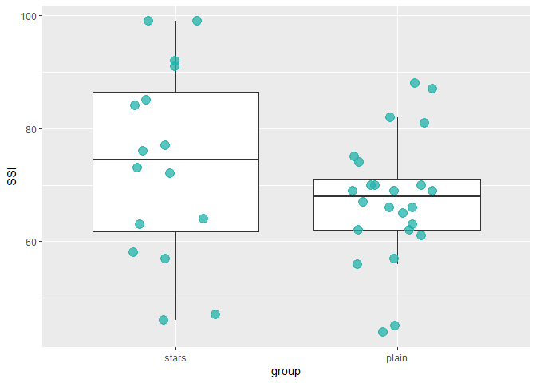
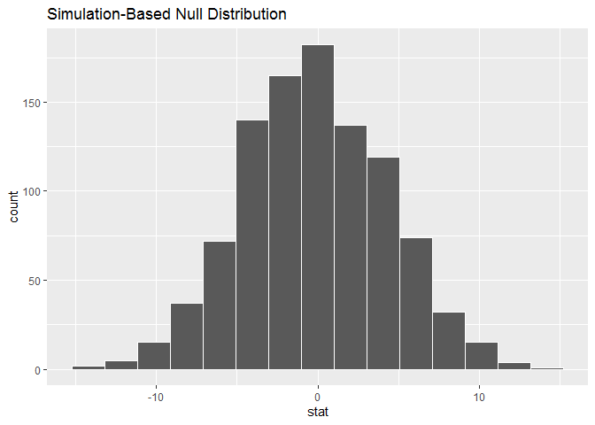
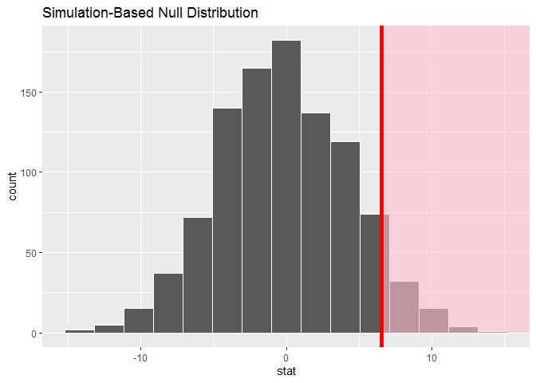

# Logistics

- A complete knitted `html` file is due on Sakai by the beginning of the next class.
- This lab is based on the assigned reading that includes [ModernDive Chapter 9.5.3](https://moderndive.com/9-hypothesis-testing.html#conducting-the-hypothesis-test). Please open and follow closely!

# Packages


```r
library(tidyverse)
library(infer)
library(skimr)
```

# Introduction

For some context, watch this video, stop it at 4 minutes 5 seconds:
https://www.youtube.com/watch?v=PdLPe7XjdKc

Let's play with some obviously fictitious data. Our outcome measure is the Sneetch Snootiness Index (SSI), which we measured for both plain-bellied sneetches (`"plain"`) and those with stars upon thars (`"stars"`). Here is our data for N = 40 sneetches, where I have SSI scores for m = 16 star-bellied sneetches and n = 24 plain-bellied sneetches.


```r
stars <- c(84, 57, 63, 99, 72, 46, 76, 91, 85, 58, 64, 99, 73, 47, 77, 92, rep(NA, 8))
plain <- c(81, 74, 56, 69, 66, 62, 69, 61, 87, 65, 44, 69, 82, 75, 57, 70, 67, 63, 70, 62, 88, 66, 45, 70)
sneetches <- data.frame(stars, plain)
sneetches_tidy <- sneetches %>%
  gather(group, SSI, factor_key = TRUE) %>%
  filter(!is.na(SSI))
sneetches_tidy
```

```
   group SSI
1  stars  84
2  stars  57
3  stars  63
4  stars  99
5  stars  72
6  stars  46
7  stars  76
8  stars  91
9  stars  85
10 stars  58
11 stars  64
12 stars  99
13 stars  73
14 stars  47
15 stars  77
16 stars  92
17 plain  81
18 plain  74
19 plain  56
20 plain  69
21 plain  66
22 plain  62
23 plain  69
24 plain  61
25 plain  87
26 plain  65
27 plain  44
28 plain  69
29 plain  82
30 plain  75
31 plain  57
32 plain  70
33 plain  67
34 plain  63
35 plain  70
36 plain  62
37 plain  88
38 plain  66
39 plain  45
40 plain  70
```


Let's look at our data for N = 40 sneetches, where I have SSI scores for m = 16 star-bellied sneetches and n = 24 plain-bellied sneetches.


```r
sneetch_plot <- ggplot(sneetches_tidy, aes(x = group, 
                                           y = SSI)) + 
  geom_boxplot(outlier.shape = NA) +
  geom_jitter(position = position_jitter(height = 0, width = 0.2), 
              fill = "lightseagreen", 
              colour = "lightseagreen", 
              alpha = 0.75, 
              size = 4, 
              na.rm=TRUE)
sneetch_plot
```

<!-- -->

__Question:__ If this were your data and plot, would you continue with the analysis? Why, or why not?


# Model of $H_0$

Moving on (regardless of your answer above). We'll use this data to compare two means using a randomization or permutation test. Our null/alternative hypotheses are:

$H_0: \mu_{stars} \leq \mu_{plain}$, which can also be written as $H_0: \mu_{stars} - \mu_{plain} \leq 0$.

Our alternative hypothesis will be of the form $H_a: \mu_1 \star \mu_2$ (or $H_a:  \mu_1 - \mu_2 \, \star \, 0$) where $\star$ = $<$, $\ne$, or $>$. For this example, we'll use: $H_a: \mu_{stars} > \mu_{plain}$.

So to sum up:

- $H_0: \mu_{stars} - \mu_{plain} \leq 0$
- $H_a: \mu_{stars} - \mu_{plain} > 0$


__Question:__ Do we have reason to believe, based on the sample distributions of SSIs over the two groups of sneetches, that star-bellied have a significantly higher SSI as compared to that of plain-bellied sneetches? 

__Question:__ Is a directional (greater-than, one-tailed) hypothesis justified? That is, do you have any previous research suggesting that star-bellied sneetches are prone to higher SSIs? ( FYI - We'll talk more about this in the next class. )


# Test statistic $\delta$  
  
From our hypotheses, we are interested in seeing whether the difference in the sample means, $\bar{x}_{stars} - \bar{x}_{plain}$, is statistically greater than 0. We can now come back to our `infer` pipeline for computing our observed statistic. Note the `order` argument that shows the mean value for `"plain"` being subtracted from the mean value of `"stars"`.

# Observed effect $\delta^*$

Our first step is to calculate the difference between sample means you got!


```r
mean_diff <- sneetches_tidy %>% 
  specify(SSI ~ group) %>% 
  calculate(stat = "diff in means", 
            order = c("stars", "plain")) 
mean_diff
```

```
# A tibble: 1 x 1
   stat
  <dbl>
1  6.52
```

Our goal next is to figure out a random process with which to simulate the null hypothesis being true. Recall that $H_0: \mu_{stars} - \mu_{plain} \leq 0$ corresponds to us assuming that the population means are the same (or that `"stars"` are less than `"plain"`). We would like to assume the null is true and perform a random process to `generate()` data in the model of the null hypothesis.


# Reshuffling

The basic idea to a permutation test is that we reshuffle the deck. Here the deck is our observed sample data, and when we reshuffle, we are re-ordering the samples according to the null hypothesis as if the group that each observation came from (`"stars"` versus `"plain"`) does not matter. First, imagine that all of our observed SSI scores are stored in one vector (both groups stacked on top of each other), and numbered 1 through 40 (regardless of group).

Next, we shuffle the non-missing observation numbers (rows 1:40), choosing a new `"stars"` group of size n = 16 from the n = 40 observed data points **without replacement**. Let's do this once:


```r
set.seed(2018)
sn1 <- sneetches_tidy %>% 
  specify(SSI ~ group) %>% 
  hypothesize(null = "independence") %>% 
  generate(reps = 1, type = "permute")

sn1
```

```
Response: SSI (numeric)
Explanatory: group (factor)
Null Hypothesis: independence
# A tibble: 40 x 3
# Groups:   replicate [1]
     SSI group replicate
   <dbl> <fct>     <int>
 1    77 stars         1
 2    63 stars         1
 3    99 stars         1
 4    74 stars         1
 5    66 stars         1
 6    85 stars         1
 7    91 stars         1
 8    70 stars         1
 9    66 stars         1
10    61 stars         1
# ... with 30 more rows
```

__Questions:__  Based on your understanding of resampling... 

* What is the overall $N$ in sn1 (e.g., the resample we just created)?
* What are the per-group $n$'s in sn1?
* What is the overall mean of `SSI` in sn1?
* Are the group means of `SSI` in sn1 different from in your original sample data?

__Use R to verify the answers you gave above.__


## Random Sampling
Remember, our observed mean is 6.52. So, this new resampled mean difference is 1.62, calculated as if it didn't matter if the real `"stars"` were `"stars"`, is much smaller. Now, this was just one possible resample. How many possible ways are there to choose 16 observations from 40? 


```r
choose(40, 16)
```

```
[1] 62852101650
```

```r
# choose(40, 24) same thing
```

That is, there are 62852101650 possible permutations:
$$\binom{m + n}{m} = \binom{16 + 24}{16} = 62,852,101,650$$


This is a pretty unmanageable number for a relatively small data set! So we make do with an approximation: we will take a large number of resamples, resampling **with replacement from the null distribution** of $\binom{m + n}{m}$ possible resamples. Sampling without replacement would be more accurate, but it would require too much time and memory to check the uniqueness of each resample. Long story short: we don't create **all possible resamples** in a permutation test, which is why this is referred to as a [Monte Carlo permutation test](https://en.wikipedia.org/wiki/Resampling_%28statistics%29#Monte_Carlo_testing).

# Distribution of $\delta$ under $H_0$

We can now proceed in a similar way to what we have done previously with bootstrapping by repeating this process many times to create simulated samples, assuming the null hypothesis is true.


```r
set.seed(1980)
null_distn <- sneetches_tidy %>% 
  specify(SSI ~ group) %>% 
  hypothesize(null = "independence") %>% 
  generate(reps = 1000, type = "permute") %>% 
  calculate(stat = "diff in means", 
            order = c("stars", "plain"))
```

A **null distribution** of simulated differences in sample means is created with the specification of `stat = "diff in means"` for the `calculate()` step. The **null distribution** is similar to the bootstrap distribution we saw in [Chapter 8](http://moderndive.netlify.com/8-confidence-intervals.html), but remember that it consists of statistics generated assuming the null hypothesis is true. Let's plot the permutation distribution, which is the distribution of mean differences across all permutation resamples:


```r
null_distn %>% 
  visualize()
```

<!-- -->

So here, what you are looking at, is our *new* null distribution- one that is *not* based on any distributional assumptions. Rather, this null distribution (the permutation distribution) is based on our sample data, and we ask "in how many permutation resamples did we get a [insert statistic here] as or more extreme than the one we got with our actual sample data?"

So, how many resampled mean differences are as or more extreme than the one we got? The answer to this question is why we calculate the p-value.

# The p-value

Remember that we are interested in seeing where our observed sample mean difference of 6.52 falls on this null/randomization distribution. We are interested in `"stars"` being greater than `"plain"`, so "more extreme" corresponds to values in the right tail on the distribution. Let's shade our null distribution to show a visual representation of our $p$-value:


```r
null_distn %>% 
  visualize() +
  shade_p_value(mean_diff, direction = "greater")
```

<!-- -->

Remember that the observed difference in means was 6.52. We have shaded red all values at or above that value. By giving `obs_stat = mean_diff`, a vertical darker line is also shown at 6.52. 

At this point, it is important to take a guess as to what the $p$-value may be.  We can see that there are only a few permuted differences as or more large than our observed effect. Lastly, we calculate the $p$-value directly using `infer`:


```r
mean_diff_number <- mean_diff %>% 
  pull(1)

(pvalue <- null_distn %>%
  get_pvalue(obs_stat = mean_diff, direction = "greater"))
```

```
# A tibble: 1 x 1
  p_value
    <dbl>
1   0.067
```

```r
# Same as calculating what proportion of the samples had a larger difference
null_distn %>% 
  tally(stat >= mean_diff_number)/1000
```

```
      n
1 0.067
```

We have around 6.7% of values as or more large than our observed statistic. Assuming we are using a 5% significance level for $\alpha$, we lack evidence supporting the conclusion that the mean SSI scores are higher in star-bellied compared to plain-bellied sneetches. 

# Corresponding confidence interval

One of the great things about the `infer` pipeline is that going between hypothesis tests and confidence intervals is incredibly simple. To create a null distribution, we ran:


```r
null_distn <- sneetches_tidy %>% 
  specify(SSI ~ group) %>% 
  hypothesize(null = "independence") %>% 
  generate(reps = 1000, type = "permute") %>% 
  calculate(stat = "diff in means", 
            order = c("stars", "plain"))
```

To get the corresponding bootstrap distribution with which we can compute a confidence interval, we can just remove or comment out the `hypothesize()` step since we are no longer assuming the null hypothesis is true when we bootstrap:


```r
boot_sneetch <- sneetches_tidy %>% 
  specify(SSI ~ group) %>% 
  #hypothesize(null = "independence") %>% 
  generate(reps = 1000, type = "bootstrap") %>% 
  calculate(stat = "diff in means", 
            order = c("stars", "plain"))

(boot_sneetch_ci <- boot_sneetch %>% 
  get_ci())
```

```
# A tibble: 1 x 2
  `2.5%` `97.5%`
   <dbl>   <dbl>
1  -2.94    16.8
```

```r
(null_sneetch_ci <- null_distn %>%
  get_ci())
```

```
# A tibble: 1 x 2
  `2.5%` `97.5%`
   <dbl>   <dbl>
1  -8.69    8.40
```


```r
# See both CIs (null and bootstrap), in a slightly complicated chart
# Run it the way it is to see the bootstrap CIs overlayed onto the null dist. 
# Then remove the #'s to see the CI for the null distribution,
#   and the bootstrap distribution.

# The red is the boot_sneetch dist with red bars for its CI
# The black/gray is the null distribution with gray bars for its CI
# The dotted black line is original difference in the means
null_distn %>% 
  visualize() +
#  shade_confidence_interval( 
#            endpoints = null_sneetch_ci,
#            color = "gray",
#            fill = "transparent") +
  shade_confidence_interval( 
            endpoints = boot_sneetch_ci,
            color = "red",
            fill = "transparent") +
#  geom_histogram(data = boot_sneetch, aes(x=stat), fill = "red", alpha = 0.4) +
  geom_vline(xintercept = pull(mean_diff), size = 1, linetype = 5)
```

<!-- -->

__Question:__ Is 0 inside the 95% confidence interval for the bootstrapped distribution? What does that imply? 

__Question:__ Is the original mean difference outside the 95% confidence interval for the null distribution? What does that imply? 


# Assumptions & Caveats

Permutation tests cannot solve all problems: they are valid only when the null hypothesis is 'no association'. Pooling the data to do a two-sample permutation test *does* require that the two *populations* (not necessarily samples) have the same distribution when the null hypothesis is true, that is, the mean, spread, and shape are the same. But you should feel fairly confident that, for example, there is not bias present in one sample. Like all methods, it will only work if your samples are representative - always be careful about selection biases! You may also get into dangerous territory if you have sample sizes in your two groups that are pretty uneven (also known as unbalanced), and this is accompanied by group differences in spread. When groups are the same size, the Type I error rate is typically close to the nominal level, otherwise it can be too high or too low.


