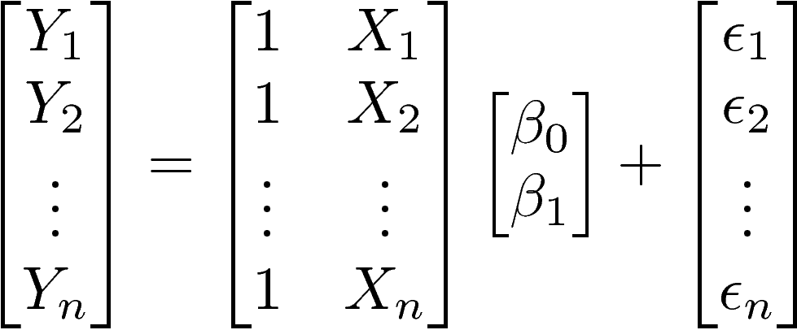
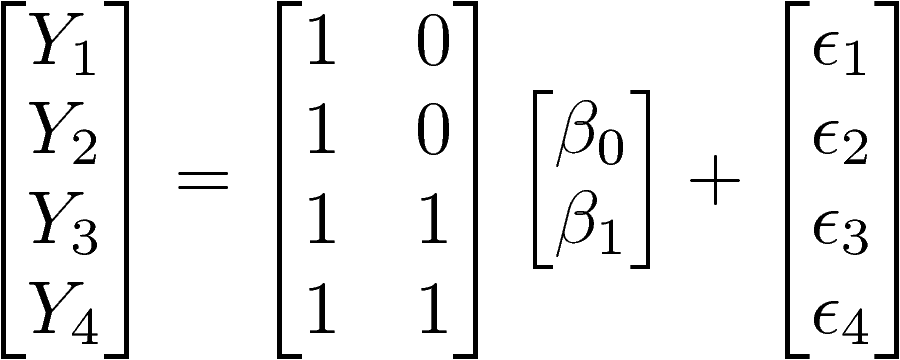

```{r setup_new, include=FALSE}
# leave this chunk alone
options(htmltools.dir.version = FALSE)
options(knitr.table.format = "html") 
knitr::opts_chunk$set(warning = FALSE, message = FALSE, 
  comment = NA, dpi = 300, out.width = '60%', cache = FALSE)

# knitr::opts_chunk$set(warning = FALSE, message = FALSE, 
#   comment = NA, dpi = 300,
#   fig.align = "center", cache = FALSE)

```


```{r libraries, include=FALSE}
library(tidyverse)
library(infer)
library(moderndive)
library(car)
library(broom)
```


## Family of *t*-tests

- One-sample *t*-test
- Dependent samples *t*-test (also known as paired) 
- Independent samples *t*-test

???

* Already spent time on one-sample
* And paired vs independent in the homework


---
class:center
## What do they all have in common?

--
We want to compare two things- mean 1 and mean 2!


---
## Ways to get paired samples

* Collect data from each participant under two different experimental conditions 
  * Cognitive load - do people engage in more self-directed speech when the task is more difficult?
  * Classical music versus silence - which is more conducive to writing?
* Collect data before and after some "treatment" 
  * Aromatherapy - do people react more quickly after being exposed to lavendar scent?
  * Drug Trial - do Beta Blockers reduce blood pressure?
  
  
???

* Paired - Careful of causation 
* Conditions - balance design!!
  
* Treatment - causation

---
##Formulae for the paired _t-test_


$$t_{n-1}=\frac{\bar{d}}{SE_d}$$

$$\bar{d}=\frac{1}{n}\sum_{i=1}^n x_{i}-y_{i}$$

$${SE_d}=\frac{sd(\bar{d})}{\sqrt{n}}$$
???
* Why is it considered theoretically more powerful than the independent t-test?
* Each acts as it's own "control".
* What happens to the distribution? Narrower, just diffs, not raw
* To the t-statistic? Smaller SE means a larger t


---
## Ways to get independent samples

* Random assignment of participants to two different experimental conditions 
  * Scream versus Scream 2 - which was scarier?
  * Classical music versus silence - which is more conducive to writing?
* Naturally occurring assignment of participants to two different groups 
  * Young versus old - how does the volume their self-directed speech differ?
  
---
## Formulae for the independent samples *t*-test

$$t=\frac{(\bar{y}_1-\bar{y}_2)-(\mu_1-\mu_2)}{SE}$$
> $H_0: \mu_1-\mu_2=0$ and $H_1: \mu_1-\mu_2\neq0$

So $\mu_1-\mu_2$ is often excluded from the formula. As we now have two samples and therefore two sample variances, we need some way to combine these two variances. The answer is to __pool__ the variances to estimate the SE of the difference, $(\bar{y}_1-\bar{y}_2)$:
$$s_{\bar{y}_1-\bar{y}_2}=s_{pooled}\times{\sqrt{\frac{1}{n_1}+\frac{1}{n_2}}}$$
and $s_{pooled}$ is:
$$s_{pooled}=\sqrt{\frac{(n_1-1)s_{y_1}^2+(n_2-1)s_{y_2}^2}{n_1+n_2-2}}$$

???
* Student's t assumes the ns and vars are ~equal
  * Thus they can be "pooled" without one taking over
  * Dangerous with wildly different n's
* R t.test() assumes unequal variances
* Many suggest to always use Welch's - 

---

# Welch's *t*-test: Dealing with unequal variances

Again, the formula for the independent groups *t*-test:

$$t=\frac{(\bar{x}_1-\bar{x}_2)-(\mu_1-\mu_2)}{SE}$$

In Welch's formula, we calculate the SE differently:
$$SE'=\sqrt{\frac{s_1^2}{n_1}+\frac{s_2^2}{n_2}}$$

So the formula for Welch's $t'$: 
$$t'=\frac{(\bar{x}_1-\bar{x}_2)-(\mu_1-\mu_2)}{\sqrt{\frac{s_1^2}{n_1}+\frac{s_2^2}{n_2}}}$$

???
* Weighted combination of each groups sd 
* Thus no "swamping"

---

# Welch's *t*-test: Modified degrees of freedom

Recall the degrees of freedom for the independent groups *t*-test:

$$\nu=(n_1-1)+(n_2-1)$$


The degrees of freedom are modified for Welch's $t'$: 

$$\nu'=\frac{(\frac{s_1^2}{n_1}+\frac{s_2^2}{n_2})^2}{\frac{s_1^4}{n_1^2(n_1-1)}+\frac{s_2^4}{n_2^2(n_2-1)}}$$

???
* Yuck!
* Remember, if you see a decimal df, it used the Welch's formulae


---
class: center, middle
# The *t*-test as a general linear model (GLM) 


---
##Prestige of Canadian Occupations - dataset

* education
  + Average education of occupational incumbents, years, in 1971.

* income
  + Average income of incumbents, dollars, in 1971.

* prestige
  + Pineo-Porter prestige score for occupation, from a social survey conducted in the mid-1960s (0 - 100).

* type
  + Type of occupation. A factor with levels (note: out of order): bc, Blue Collar; prof, Professional, Managerial, and Technical; wc, White Collar.

---
## The general linear model (GLM) 

All statistical procedures are basically the same thing:
$$outcome_i=(model)+error_i$$

For example: 
$$prestige_i=(intercept + education_i)+error_i$$

Or more generally:
$$y_i=(b_0 + b_1x_i)+error_i$$

> __N.B.__ $Error_i$ is an unknowable, incalculable statistic- it is the deviation of the $i^{th}$ value from the (unobservable) true value. You can think of it as measurement error. This is different from the error of the regression formula, which is defined as the *residual* of the $i^{th}$ value and calculated as the difference between the observed $(y_i)$ and predicted scores $(\hat{y_i})$. 


---
## Sidebar: The GLM in matrix notation
The GLM we have been dealing with thus far includes just one independent variable and thus just one $b_1$. However, the full GLM is better represented as a matrix

$$\boldsymbol{Y}=\boldsymbol{X}\boldsymbol{\beta}+\boldsymbol{\epsilon}$$

where...

* $\boldsymbol{Y}$ is the *response vector* of length *N*;

* $\boldsymbol{\epsilon}$ is the *error vector* of length *N*;

* $\boldsymbol{\beta}$ is the vector of parameters of length *p*+1 where *p* is the number of IVs and the 1 accounts for the intercept;

* and $\boldsymbol{X}$ is called the *design matrix* consisting of a matrix of *N* rows and *p+1* columns

---

# Design matrices with one independent variable

.pull-left[
In both simple linear regression and the independent samples *t*-test, $\boldsymbol{X}$ is a matrix of *N* rows and *2* columns. Note that the number of columns in $\boldsymbol{X}$ must always equal the number of rows in $\boldsymbol{\beta}$.


]

--
.pull-right[
In simple linear regression, the vector *X* can take on any value. In the independent samples *t*-test, this vector simply contains 0's and 1's. Below, *n*=4 with 2 in each group to illustrate.


]


???
* Notice the 0's and 1's used to denote the 2 factors
* All this happens under the covers in R when it conducts a t-test (or a linear regression with factors ;)
---

## Dummy variables

.pull-left[

Thus, we'll be using a group variable:
$$prestige_i=(intercept + group_i)+error_i$$

where group is a dummy or indicator variable that can only take two values: 0 or 1. 

This is easy to do in R. In the Prestige dataset, there is a categorical variable called "type." Let's let the variable Group denote:

> 0 for blue collar (type="bc") and

> 1 for white collar (type="wc")
]

.pull-right[

<div style="position: relative; left: 0; top: 0;">
  
  
</div>
]

---

# Creating a dummy variable in R


```{r warning = FALSE, message = FALSE}
library(car)
table(Prestige$type)
```


```{r}
Prestige <- Prestige %>% 
  mutate( group = 
      case_when(type == "bc" ~ 0,
                type == "wc" ~ 1
  ))

table(Prestige$type, Prestige$group)
```


---

# Cleaning up the new dataset

```{r}
Prestige.2 <- Prestige %>% 
  filter(!is.na(group)) %>% 
  droplevels()
```

---

# OK, we are all set now with two groups

```{r}
table(Prestige.2$type, Prestige.2$group)
```


```{r}
head(Prestige.2)
```


---

# Plotting data for two groups

Not surprisingly, mean prestige ratings appear to be higher among white collar workers than blue collar workers.

```{r warning=FALSE, message=FALSE, echo = FALSE}
library(ggplot2)
Prestige.2$group.l <- factor(Prestige.2$group, labels=c("bc","wc"))
ggplot(Prestige.2, aes(x=factor(group.l),y=prestige)) + geom_dotplot(stackdir = "centerwhole",binwidth=1,binaxis='y', alpha=.5)+theme_bw() + geom_segment(aes(x=0.75, y=mean(Prestige.2$prestige[Prestige.2$group==0]), xend=1.25, yend=mean(Prestige.2$prestige[Prestige.2$group==0]))) + geom_segment(aes(x=1.75, y=mean(Prestige.2$prestige[Prestige.2$group==1]), xend=2.25, yend=mean(Prestige.2$prestige[Prestige.2$group==1]))) 

```

???
* Means are different
* Spread is okay-ish - not worried
* 44 vs 23 data points - okay, close enough
---

# But are the two groups different?

Let's do an independent samples *t*-test to find the answer:


```{r}
t.test(prestige~group,data=Prestige.2, var.equal=T)
```

???
* Significant, note t-value on board
* df - not a decimal!
  * Decimal always indicates a non-pooled variance
* Is 0 in the CI?
* Sample means


---

# What happens if I now run a linear regression?

<div style='text-align: center;'>
    
</div>

---

# Kidding. Here's is the linear regression summary... 

```{r}
fit <- lm(formula = prestige ~ group, data = Prestige.2)
summary(fit)
```


???
* Positive t here is okay, dist is symmetric
* Same p, same t on group
* Intercept = mean blue collar
* Intercept plus group = mean whilte collar
* F = t-squared! 
* ??What would happen if we used "type" instead of "group??
---

# But what does it MEAN?

Let's do a quick review of the linear regression formula:
$$y_i=(b_0 + b_1x_i)+error_i$$

Solving for the intercept term, for example, we need to apply some summation algebra:
$$\frac{1}{n}\sum_i^n{y_i}=\frac{1}{n}\sum_i^n{b_0} + \frac{1}{n}\sum_i^n{b_1x_i}+\frac{1}{n}\sum_i^n{error_i}$$

A few reminders about summation algebra in this context:
- The mean is defined as: $\frac{1}{n}\sum_i^n{y_i}$
- The sum of a constant is just *n* times the constant: $\sum_i^n{b_0}=n\times{b_0}$
- The sum of a constant times a random variable is the constant times the sum of the variable: $\sum_i^n{b_1x_i}=b_1\sum_i^n{x_i}$
- By definition, in GLM, we assume the mean of the error is 0: $\frac{1}{n}\sum_i^n{error_i}=0$

---

# Solving for the regression coefficients

Applying the summation algebra from the previous slide, we get:
$$\frac{1}{n}\sum_i^n{y_i}=\frac{1}{n}nb_0 + \frac{1}{n}b_1\sum_i^n{x_i}$$
$$\bar{y}=b_0 + b_1\bar{x}$$

This should look familiar! The formula for the regression intercept term, $b_0$, is:
$$b_0=\bar{y}-b_1\bar{x}$$

But look again: we also have the formula for $\bar{y}$. The intercept term in linear regression is the expected mean value of $y$ when $x_i$=0.

---

# Solving for $\bar{x}$

.pull-left[

$$\bar{y}=b_0 + b_1\bar{x}$$

But, you protest, how do we calculate $\bar{x}$? Is it the mean of the 0/1 values in *x*? What is happening?

]

.pull-right[

<div style='text-align: right;'>
    
</div>
]

--- 

# Solving for $\bar{x}$

.pull-left[
$$t=\frac{(\bar{y}_1-\bar{y}_2)-(\mu_1-\mu_2)}{SE}$$
Remember the original formula I gave you for the *t* statistic. There is no *x*! But implicitly, this formula is actually:
$$t=\frac{(\bar{y}_{x=1}-\bar{y}_{x=2})-(\mu_{x=1}-\mu_{x=2})}{SE}$$

So what we are actually interested in the mean of *y* when *x* takes on one value versus another (in my current example, *x*=0 or 1). 
]

.pull-right[

<div style='text-align: right;'>
    
</div>
]

---

# The intercept

For the *t*-test, we can solve for the intercept just as we can for the simple linear regression. Remember our formula for $\bar{y}$:
$$\bar{y}=b_0 + b_1\bar{x}$$

Let's re-write it two ways:
$$\bar{y}_{x=0}=b_0 + b_1\bar{x_0}$$
$$\bar{y}_{x=1}=b_0 + b_1\bar{x_1}$$

Start with the top formula: What is $\bar{x_0}$? This is simple to think about in matrix notation- the mean of a vector of 0's is 0. So, when the group variable is equal to zero (blue collar)...
 
$$\bar{y}_{bc}=(b_0 + b_1\times0)=b_0$$

Therefore, $b_0$ (the intercept term) is equal to the mean prestige score of the blue collar group (the one coded as 0).

---

# The slope

Now, let's tackle the second formula:
$$\bar{y}_{x=1}=b_0 + b_1\bar{x_1}$$

When the group variable is equal to 1 (white collar), $\bar{x_1}=1$ because the mean of a vector of 1's is 1.
$$\bar{y}_{wc}=(b_0 + b_1\times1)$$
$$\bar{y}_{wc}=b_0+ b_1$$
$$\bar{y}_{wc}=\bar{y}_{bc}+ b_1$$

Solving for $b_1$:
$$b_1=\bar{y}_{wc}-\bar{y}_{bc}$$

Therefore, $b_1$ (the slope) is equal to the difference between group means in prestige scores. 

---

# What does this mean?

We could represent a two-group experiment as a regression equation in which the regression coefficient $b_1$ is equal to the difference between group means and the intercept term $b_0$ is the mean of the group coded as 0.

Our independent samples *t*-test would take the form:
$$y_i=\bar{y}_{bc} + (\bar{y}_{wc}-\bar{y}_{bc})x_i+error_i$$

Think of it this way: the regression line must pass through these two points:
- (0, $\bar{y}_{bc}$)
- (1, $\bar{y}_{wc}$)

---

# Trust but verify


```{r}
Prestige.2 %>%
  group_by(type) %>% 
  summarize(mean = mean(prestige)) %>% 
  mutate(diff_means = mean - dplyr::lag(mean))

```


So, bc is $b_0$ and diff is $b_1$...right?


```{r}
coef(fit)
```


---

# The General Linear Model

A number of different statistical models are extensions of this same idea of a GLM:

- Ordinary least squares (OLS) linear regression (simple and multiple): 1+ predictors may be continuous or factors
- *t*-test: a *t*-test is basically a regression model where the 1 predictor is a factor with exactly 2 levels
- Analysis of Variance/Covariance (ANOVA/ANCOVA): an ANOVA is basically a regression model where the 1+ predictors are factors
- Multivariate Analysis of Variance/Covariance (MANOVA/MANCOVA): a MANOVA is basically a regression model with 2+ DVs where the 1+ predictors are factors

---

#  But wait, there's more... 

* Regression coefficients, divided by their standard errors, are **also** distributed as t variables
* Degrees of freedom: *n* - 2 (in simple linear regression, because we have to account for the 2 coefficients we estimated from the sample data: the intercept + the slope).
* In our example, the $t_{crit}$ quantile is ( df = n - 2 = 65):

``` {r lr-tcrit}
qt(.975,df=65)
```


---
#Is the slope different from zero? 

$$t_{b_1}=\frac{b_1 - \beta_1}{\hat{SE_{b_1}}}$$

###What is $\beta_1$ under the null hypothesis?

???
Thus the t-statistic is simply the regression coefficient divided by the standard error. 

---
#What is the 95% confidence interval? 

$$b_1 \pm t_{\frac{\alpha}{2}}\hat{SE_{b_1}}$$


i.e., $\alpha = .05: t_{crit}=t_{\frac{\alpha}{2}} = qt(.975, df=n-2)$

 
### Mainly of interest for slope, not so much intercept

---
###Comparing...
```{r}
n=67
coefs_t = tidy(fit) %>%
  mutate (t = estimate/std.error)
coefs_t
```

```{r}
coefs <- tidy(fit, conf.int = TRUE)
coefs_conf <- coefs %>% 
   mutate(lower = estimate + qt(.025, df = n - 2)*std.error,
          upper = estimate + qt(.975, df = n - 2)*std.error)
coefs_conf %>%
   select(conf.low,conf.high, lower, upper)
```


---
###Model Level Significance. The F-statistic

```{r}
summary(fit)
(f <- coefs_conf$statistic[2]^2)
```


---

# Food for thought...

The independent samples *t*-test is a special case of an ANOVA. Specifically, a one-way ANOVA (definition: 1 IV that is a factor and 1 DV that is continuous) in which the IV factor has *exactly* two levels.

Again, trust but verify!

```{r}
anova(lm(prestige~group,data=Prestige.2)) #doing an ANOVA in R
```


(hint: square the *t*-statistic to get the *F*-statistic equivalent)


---

# George E. P. Box

> "Equally, the statistician knows, for example, that in nature there never was a normal distribution. There never was a straight line, yet with normal and linear assumptions, known to be false, he can often derive results which match, to a useful approximation, those found in the real world." -*Journal of the American Statistical Association, 71*(356), pp. 791-799.

