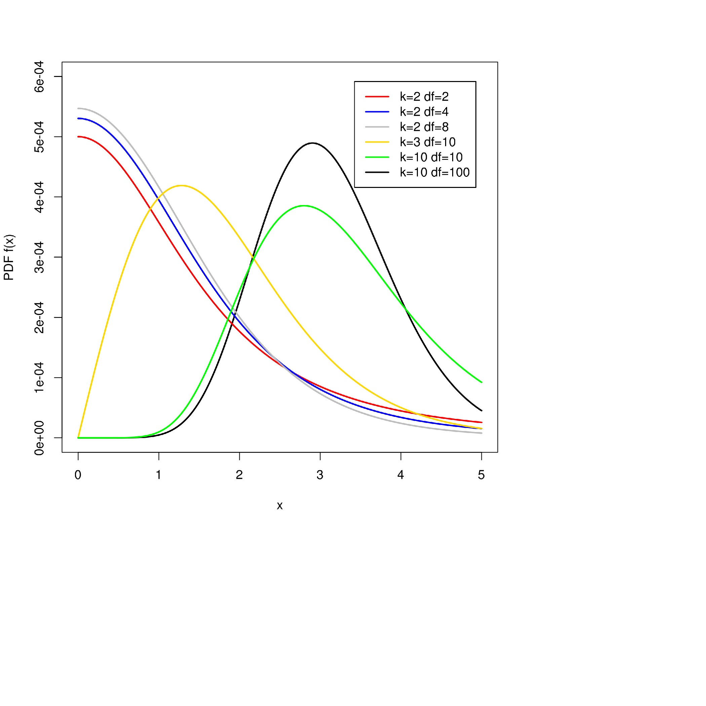

```{r setup, include=FALSE}
# options(htmltools.dir.version = FALSE)
# options(knitr.table.format = "html") 
# knitr::opts_chunk$set(warning = FALSE, message = FALSE, 
#   comment = NA, dpi = 300,
#   fig.align = "center", cache = FALSE)
```

```{r setup_new, include=FALSE}
# leave this chunk alone
options(knitr.table.format = "html") 
knitr::opts_chunk$set(warning = FALSE, message = FALSE, 
  comment = NA, dpi = 300, out.width = '60%', cache = FALSE)
```

```{r setup_data, include=FALSE}
library(knitr)
library(tidyverse)
superhero <- tibble::tribble(
               ~hero, ~injury,
                   1,      51,
                   1,      31,
                   1,      58,
                   1,      20,
                   1,      47,
                   1,      37,
                   2,      69,
                   2,      32,
                   2,      85,
                   2,      66,
                   2,      58,
                   2,      52,
                   3,      26,
                   3,      43,
                   3,      10,
                   3,      45,
                   3,      30,
                   3,      35,
                   4,      18,
                   4,      18,
                   4,      30,
                   4,      30,
                   4,      30,
                   4,      41
               )
```


# Two key equations

When I introduced the *t*-test as a general linear model (GLM), I said that "all statistical procedures are basically the same thing":

$$outcome_i=(model)+error_i$$

Where:
* Outcome is your dependent variable (DV; also known as *y*) and
* Model is a linear function or linear combination of your independent variable(s) (IVs) (also known as *x*'s)

$$DV_i=(model)+error_i$$

"Essentially, all models are wrong, but some are useful"-George E. P. Box (1987)

$$deviation=\sum{(observed-model)^2}$$
???
* A couple minutes on linear models
* Not residuals, but expected error "in the world"
* Every statistic procedure we've looked at could be described by this function
* Let's look...
---

# The sample mean

.pull-left[
$DV_i=(1b)+error_i$

Coefficient=1 is implied.
]

.pull-right[
$DV_i=(model)+error_i$
]

???
The simplest model - the mean of the IV (no DV)
---

# Correlation

.pull-left[

$DV_i=(bIV_i)+error_i$

]

.pull-right[
$DV_i=(model)+error_i$
]

???
* Here the IV is some multiplier of the DV
* Still just a model
---

# Simple linear regression

.pull-left[

$DV_i=(b_0+b_1IV_i)+error_i$

Where:
* $b_0$ is the intercept term and 
* $b_1$ is the slope.
]

.pull-right[
$DV_i=(model)+error_i$
]

???
* Simple - meaning one IV
* Still just a model
---

# *t* test

.pull-left[

$DV_i=(b_0+b_1IV_i)+error_i$

Where:
* $b_0$ is the intercept term ( $\bar{y}_{group1}$ ) and 
* $b_1$ is the slope ( $\bar{y}_{group2}-\bar{y}_{group1}$ )
]

.pull-right[

$DV_i=(model)+error_i$
]

???
Now it's a linear model with dummy coded categories
---

# Analysis of Variance

.pull-left[

$DV_i=(b_0+b_1IV1_i+b_2IV2_i)+error_i$
]
.pull-right[

 $DV_i=(model)+error_i$
]

???
* Same as the t, but now may need more "dummy" codes


---

# GLM logic

* The simplest model we can ever conceive of for predicting a DV of interest is the mean of that DV.
* This is called the null (or reduced) model:
 * Simple linear regression: $y_i=b_0+\epsilon_i$ 
 * ANOVA: $y_{ij}=\mu_{\bullet\bullet}+\epsilon_{ij}$ where $\mu_{\bullet\bullet}$ is the ___grand mean___

> __N.B.__ What is *not* present in these equations?

???
In the simples model, the Dependent Variable does not matter
---

## Superhero ANOVA 


```{r comment=NA, echo=TRUE}
superhero$hero <- factor(superhero$hero,labels=c("Spiderman", "Superman", "Hulk", "TMNT"))
heroaov <- aov(injury~hero,data=superhero)
summary(heroaov)
```
???
* Let's look at an example
* an anova(lm()) would give the same output
* What does this tell us?
  * A significant effect of the DV
---

## Now what?

```{r echo=FALSE}
GM <- mean(superhero$injury)
library(ggplot2)
heroplot <- ggplot(data=superhero, aes(factor(hero), injury)) +
  geom_boxplot(aes(fill=factor(hero))) + 
  theme(axis.title.x = element_blank()) + 
  scale_x_discrete(labels=c("Spiderman", "Superman", "Hulk", "TMNT")) + 
  theme(legend.position="none") +
  geom_hline(yintercept = GM, size = 1, linetype = 2, color = "chocolate4")
heroplot
```

???
* Maybe do nothing - well, put a chart
* Maybe drill down - doing post-hoc analyses
  * Important - anova and the post-hoc analyses answer two differenct questions
---

## Contrasts!

|Contrast |Spiderman|Superman|Hulk|TNMT|
|:------:|:------:|:-------:|:----:|:---:|
|Spiderman vs. Superman|1|-1|0|0|
|Spiderman vs. Hulk|1|0|-1|0|
|Hulk vs. TNMT|0|0|1|-1|


These say:
$$+1\mu_{spiderman}-1\mu_{superman}+0\mu_{hulk}+0\mu_{TNMT}$$
$$+1\mu_{spiderman}+0\mu_{superman}-1\mu_{hulk}+0\mu_{TNMT}$$
$$0\mu_{spiderman}+0\mu_{superman}+1\mu_{hulk}-1\mu_{TNMT}$$
???
* Contrasts are how R determines what to compare to what
* Matrix format
* Think back to linear models - each was an offset from the Intercept
* Model coefficients represent the differences specified by the contrasts

---

## Contrasts!

$$+1\mu_{spiderman}-1\mu_{superman}+0\mu_{hulk}+0\mu_{TNMT}\rightarrow\mu_{spiderman}-\mu_{superman}=0$$
$$+1\mu_{spiderman}+0\mu_{superman}-1\mu_{hulk}+0\mu_{TNMT}\rightarrow\mu_{spiderman}-\mu_{hulk}=0$$
$$0\mu_{spiderman}+0\mu_{superman}+1\mu_{hulk}-1\mu_{TNMT}\rightarrow\mu_{hulk}-\mu_{TNMT}=0$$
???
* More importantly, we're asking that R compute which of these means are significantly different

---

## Doing all pairwise contrasts in R

```{r comment=NA}
pairwise.t.test(superhero$injury,superhero$hero,p.adjust.method="none")
```

**Base R's output=just the *p*'s, please!**


???

* Here's a full pairwise comparison
* Using pooled SD across all the observations


---

## Doing all pairwise contrasts in R (better)

```{r comment=NA, warning=FALSE, message=FALSE, results="hide"}
library(multcomp)
mcp <- glht(heroaov,linfct=mcp(hero="Tukey")) # "Tukey" sets up the pairwise comparisons 
summary(mcp,test=adjusted("none")) #Same as pairwise.t.test() above 
```

You get:

* the *p*'s __plus__
* the *t*'s
* the $\psi$'s
* the $SE_{\psi}$'s
* oh my!

???
Tukey is not adjusting

---

## Doing all pairwise contrasts in R (better)

```{r comment=NA, warning=FALSE, message=FALSE, echo=FALSE}
library(multcomp)
mcp <- glht(heroaov,linfct=mcp(hero="Tukey"))
summary(mcp,test=adjusted("none"))
```

---

## Where are these numbers coming from?

$$estimate=\psi={\sum_{j=1}^kc_j\bar{y_j}}$$

where...
$$SE_{est}=\hat{\sigma_{\psi}}=\sqrt{MS_{error}\times{(\frac{1}{n_1}+\frac{1}{n_2})}}$$

And the *c* terms are contrast coefficients. Thus a more general formula is:

$$t_{contrast}=\frac{estimate}{SE_{est}}=\frac{\psi}{\hat{\sigma_{\psi}}}=\frac{\sum_{j=1}^kc_j\bar{y_j}}{\sqrt{MS_{error}\times{\sum_{j=1}^k\frac{c_j^2}{n_j}}}}$$
???
* c is the contrast
* Estimate is just the difference of the means
* SE is a weight adjusted MS error
* Higher n (in SE) -> smaller denominator -> larger t!
---


## This is different from the independent samples *t* test

$$t=\frac{(\bar{y}_1-\bar{y}_2)-(\mu_1-\mu_2)}{\sqrt{\frac{(n_1-1)s_{y_1}^2+(n_2-1)s_{y_2}^2}{n_1+n_2-2}}}$$


Which is usually just written as:
$$t=\frac{(\bar{y}_1-\bar{y}_2)}{\sqrt{\frac{(n_1-1)s_{y_1}^2+(n_2-1)s_{y_2}^2}{n_1+n_2-2}}}$$
???
*SE is just across two groups


---

## Contrast degrees of freedom

For the pairwise *t* tests ( $t_{contrast}$ ), the degrees of freedom for __each__ contrast are the same: *N-k* (where *N*= total participants and *k*=number of groups)

If we were to conduct an independent samples *t* test, what would the degrees of freedom be? 
* The answer is: $n_1+n_2-2$
* This is the same as *N-k*, where *k* must always be 2 for the independent samples *t*-test.
* In our example contrast, this is the difference between 20 and 10 degrees of freedom

```{r include=FALSE}
hero2 <- subset(superhero,hero=="Spiderman"|hero=="Superman")
t.test(injury~hero,data=hero2,paired=F, var.equal=T)
```

???
What happens when your df are higher?

---

## Increased degrees of freedom


|Degrees of Freedom| $\alpha=.05,\:2-tailed$ |
|:-------:|:----------:|
|10|__2.228__|
|11|2.201|
|12|2.179|
|13|2.160|
|14|2.145|
|15|2.131|
|16|2.120|
|17|2.110|
|18|2.101|
|19|2.093|
|20|__2.086__|

---

## Defining contrast coefficients

We base the *c* terms off of the hypotheses. Let's take a look at the superhero data:
```{r comment=NA, echo=FALSE}
superhero %>% 
  group_by(hero) %>% 
  summarise(mean = mean(injury),sd = sd(injury), n = n())
```

???
* Order matters
* matix size is dependent on the number of comparisons

---

## Defining contrast coefficients: contrast 1

```{r include=FALSE}
library(psych)
describeBy(superhero$injury,superhero$hero)
```


|Contrast |Spiderman|Superman|Hulk|TNMT|
|:------:|:------:|:-------:|:----:|:---:|
|Spiderman vs. Superman|1|-1|0|0|
| $\bar{y_j}$ |40.67|60.33|31.5|27.83|

$$\psi=\sum_{j=1}^kc_j\bar{y_j}=(1)\times{40.67}+(-1)\times{60.33}=-19.667$$

$$\hat{\sigma_{\psi}}=\sqrt{188.85\times{(\frac{1}{6}+\frac{1}{6})}}=\sqrt{188.85\times{.333}}=7.934$$

$$t_{contrast}=\frac{\psi}{\hat{\sigma_{\psi}}}=\frac{-19.667}{7.934}=-2.479$$

```{r comment=NA, warning=FALSE, message=FALSE}
2*(1-pt(2.479,20)) #unadjusted 2-tailed p-value; note the df!
```

???
* Walk through 1
* Compare spiderman to superman

---

## Another post-hoc option

The Tukey Honestly Significant Difference (HSD) is a single-step procedure that analyzes all possible pairwise contrasts between group means.

Instead of a *t* statistic ( $t_{contrast}$ ), now we have:
* The HSD value for a family of contrasts
* The Tukey statistic, $q_{contrast}$, for each individual contrast within the family

???
* More conservative statitic

---

## Tukey Honestly Significant Difference (HSD)

$$HSD=q_{tukey}\sqrt{\frac{MSE}{2}({\frac{1}{n_1}+\frac{1}{n_2}})}$$

```{r comment=NA, warning=FALSE, message=FALSE}
#mse <- 188.85
mse <- summary(heroaov)[[1]]$"Mean Sq"[2] #I know, ugly!
ngroups <- 4 #4 groups, so 4 means
dfmse <- 20 #see ANOVA source table
q_tuk <- qtukey(.95,ngroups,dfmse)
q_tuk
```

$$HSD=3.958\times\sqrt{\frac{188.85}{2}({\frac{1}{6}+\frac{1}{6}})}=22.36$$

So, any mean difference larger than 22.36 we will consider significant according to Tukey HSD. 

---
##Studentized Range Distribution - _q_



---

## Which differences are > than our HSD of 22.36?

```{r comment=NA, warning=FALSE, message=FALSE, echo=FALSE}
summary(mcp)
```
???
*Apparently Spiderman and superman aren't "honestly" different

---

## But wait!

### Those *p*-values are different than before!

Old $p$'s...

```{r comment=NA, warning=FALSE, message=FALSE, echo=FALSE}
unitp <- summary(mcp,test=univariate())[[10]][[6]]
namep <- names(summary(mcp,test=univariate())[[10]][[6]])
unitp
```


New $p$'s...

```{r comment=NA, warning=FALSE, message=FALSE, echo=FALSE}
tukeyp <- summary(mcp)[[10]][[6]][1:6]
names(tukeyp) <- namep
tukeyp
```


---

## Tukey HSD 

That's because the *p* value is based on a __new__ statistic ( $q_{contrast}$ ), but only the *p* values in the table *glht* provides changed (which is confusing!). Let's see that new statistic...

For any specific contrast we can calculate:
$$q_{contrast}=\frac{|\psi|}{\sqrt{\frac{MSE}{2}({\frac{1}{n_1}+\frac{1}{n_2}})}}$$

```{r comment=NA, warning=FALSE, message=FALSE}
psi <- abs(-19.667) 
se <- sqrt((mse/2)*(1/6+1/6))
qobs <- psi/se
se
qobs
```

$$q_{contrast}=\frac{19.667}{\sqrt{\frac{188.85}{2}({\frac{1}{6}+\frac{1}{6}})}}=3.506$$

---

## Finding the *p*-value for Tukey HSD

So, according to Tukey HSD, we have the following:
$$q_{Spiderman\:v.\:Superman}=3.506$$

Because our critical $q_{tukey}$ was 3.958, we know that our $q_{contrast}$ of 3.506 is not significant. In fact, the *p*-value for our $q_{contrast}$ is...

```{r comment=NA, warning=FALSE, message=FALSE}
ptukey(qobs,ngroups,dfmse,lower.tail=F)
```

* __N.B.__ #1: This is the same *p* value in the *glht* output.
* __N.B.__ #2: We reach the same conclusion based on comparing our difference in means to the HSD: for Spiderman vs. Superman, 19.667 < 22.36.

---

## Note about Tukey HSD in *glht*

We have just observed something important in the *glht* output. 

* The *t* statistics correspond to our pairwise *t* test ( $t_{contrast}$ ). This is a standard *t* distributed variable.
* The *p*-values correspond to the Tukey Studentized Range Distribution ( $q_{contrast}$ ).

So in our example contrast between Spiderman and Superman:

|Distribution of Statistic|Statistic|SE|*p*-value|tails|
|:-------:|:----------:|:----:|:----:|:----:|
|Student *t* Distribution|2.479|7.93|.022|2 (can be 1)|
|Tukey Studentized Range Distribution|3.506|5.61|.094|always 1|


???
* True across glht in general??

---

## To sum up...

### Those *p*-values are different than before! Yes they are.

Old $p$'s based on Student *t* distributed statistic ( $t_{contrast}$ )...

```{r comment=NA, warning=FALSE, message=FALSE, echo=FALSE}
unitp <- summary(mcp,test=univariate())[[10]][[6]]
namep <- names(summary(mcp,test=univariate())[[10]][[6]])
unitp
```


New $p$'s based on Tukey Studentized Range statistic ( $q_{contrast}$ )...

```{r comment=NA, warning=FALSE, message=FALSE, echo=FALSE}
tukeyp <- summary(mcp)[[10]][[6]][1:6]
names(tukeyp) <- namep
tukeyp
```

---

## Why not just do a bunch of *t*-tests?

* First, note that pairwise contrasts use the degrees of freedom __based on all groups in your sample__, rather than for just the two groups in the contrast. This increases your statistical power!

* Second, pairwise contrasts (whether $t_{contrast}$ or $q_{contrast}$ ) base the standard error estimate (i.e., the denominator) on the weighted mean square error ( $MS_{error}$ ) from the overall ANOVA. Again, this tends to increase power!

* But, each individual pairwise contrast is designed to control the probability of false rejection at $\alpha$. Unfortunately, if our data analysis involves many hypothesis tests (and thus many contrasts), the probability of at least one Type I error increases rather sharply with the number of contrasts.

???
* Tukey handles this somewhat - thus the changed p-values.
* Let's look at this more closely
---

## Probability(at least one error)

For example:
* If there are *m* tests
* They are independent
* Each is performed with $\alpha$=.05
* All alternative hypotheses are __true__
* What is the probability of at least one Type I error?

???
Example
* multiple tests cholesterol
* one treatment
* leads to a multiple comparison problem
---

## Probability refresher

If we have 3 levels of a factor, and want to compare all three to each other:
1. Contrast 1 vs. 2 ( $\alpha=.05$ )
2. Contrast 2 vs. 3 ( $\alpha=.05$ )
3. Contrast 1 vs. 3 ( $\alpha=.05$ )

Probabilities:

* What is the probability that I will __incorrectly reject__ all three null hypotheses?
$$P(\alpha)\times{P(\alpha)}\times{P(\alpha)}=(.05)(.05)(.05)=.000125$$

* Using the same logic, what is the probability that I will __correctly reject__ all three null hypotheses?
$$P(1-\alpha)\times{P(1-\alpha)}\times{P(1-\alpha)}=(.95)(.95)(.95)=.8574$$
* Hmmm...

---

## Probability(at least one error)

 $$P(Type \: I \: error)=\alpha$$
 $$P(no \: Type \: I \: error)=1-\alpha$$
 $$P(no \:Type\:I\:errors\:in\:m\:tests)=(1-\alpha)^m$$
 $$P(at\:least\:one\:Type\:I\:errors\:in\:m\:tests)=1-(1-\alpha)^m$$


---

## Family-wise error rate (FWER)

The probability that I make __zero__ errors:
$$P(1-\alpha)\times{P(1-\alpha)}\times{P(1-\alpha)}=(.95)(.95)(.95)=.8574$$
The *family-wise error rate*:
$$P(at\:least\:one\:error)=1-P(no\:errors)=1-.8574=.1426 > .05$$
 Thus, the probability that I will make at least one Type I error is > .05

 $$\alpha_{family}>\alpha_{per\:test}$$


---

## We can plot this...

```{r comment=NA, echo=FALSE}
curve(1 - (1-0.05)^x,1,100, xlab="Number of Tests (m)", ylab="Pr(At Least One Type I Error)",col="red")
```

---
class: middle, center
#What can we do?

--
##Adjust the p-values!
---

## Doing all pairwise contrasts in R better*

```{r comment=NA, warning=FALSE, message=FALSE}
summary(mcp, test = adjusted("BH")) #Tukey pairwise comparison + BH p-adjustment!
```

---

## But wait!

### You changed the *p*-values again! Yes I did.

$p$'s based on Tukey's HSD...

```{r comment=NA, warning=FALSE, message=FALSE, echo=FALSE}
tukeyp
```


$p$'s with Benjamini-Hochberg adjustment...

```{r comment=NA, warning=FALSE, message=FALSE, echo=FALSE}
tukeybhp <- summary(mcp, test = adjusted("BH"))[[10]][[6]][1:6]
tukeybhp
```

---

## The Benjamini-Hochberg False Discovery Rate (FDR)

The basic idea of the FDR is to try to achieve the smallest possible fraction of false signals among all those that appear to be true (i.e., significant).

Said another way: we estimate the expected proportion of false rejections among all rejected null hypotheses and attempt to keep it under a threshold level.

Using the FDR method, we are trying to control the number of "false discoveries" rather than the number of "false positives." 

> What is the difference?

---

## False Positives & False Discoveries

Let's revisit the good ol' decision table. Let *m* be the total number of hypotheses tested.

|   |Decision: Do not reject $H_0$ |Decision: Reject $H_0$ | Total |
|:-:|:----:|:---:|:---:|
| $H_0$ is true |U <br> *True Negative*|V <br> __Type I error__/*False Positive*|   $m_0$ |
| $H_0$ is false |T <br> __Type II error__/*False Negative*|S <br> *True Positive*|  $m-m_0$
| Total | $m-R$ | $R$ | $m$ |

The false positive rate is:
$$FPR=\frac{V}{m_0}$$

The false discovery rate is:
$$FDR=\frac{V}{R}$$

---

## False Positives & False Discoveries

The __false positive rate__ is:
$$FPR=\frac{number\:of\:falsely\:rejected\:H_0s}{total\:number\:of\:true\:H_0s}$$

The __false discovery rate__ is:
$$FDR=\frac{number\:of\:falsely\:rejected\:H_0s}{total\:number\:of\:rejected\:H_0s}$$

Benjamini-Hochberg proposed to keep the latter less than $\alpha$ such that the maximum FDR is capped at $q<\alpha$.

???
* How often, when the null was true, did I think I had an effect?
* Of all the times I thought I had an effect, how often was I wrong?
  * e.g. what proportion my "discoveries" are wrong? 
---

## The FDR Method

Sort your obtained *p*-values from lowest to highest, and add the following information:

* $p$ = sorted unadjusted *p*-values (these can be based on any statistic, here Tukey HSD)
* $j$ = variable indexing the order of that contrast in the sort ( $j=1,\dotsc,m$ ) 
* $p_{BH}^*$ = critical values for *p*, based on Benjamini-Hochberg per contrast adjustments holding $q<.05$ (see next slides)

```{r comment=NA, warning=FALSE, message=FALSE, echo=FALSE}
tukeypvals <- sort(tukeyp)
j <- c(1:6)
alpha <- .05/6
threshold <- j*alpha
bh <- rbind(round(tukeypvals,3),round(j,0),round(threshold,3))
rownames(bh) <- c("p","j","p*BH")
bhnew <- data.frame(bh)
names(bhnew)<-names(tukeypvals)
bhnew
```

???

.008 = .05/6
.017 = .05/3
---

## The Benjamini-Hochberg False Discovery Rate

The previous table can be summarized more generally as:

| |smallest| $\rightarrow$ | $\rightarrow$  | $\rightarrow$ |largest|
|:--:|:---:|:--:|:--:|:--------:|:----:|
| $p-values$ | $p_1$ | $p_2$ | $p_3$ | $\dotsc$ | $p_m$ |
| $j$ |1|2|3| $\dotsc$ | $m$ |
| $p_{BH}^*$ | $\frac{1}{m}\times{\alpha}$ | $\frac{2}{m}\times{\alpha}$ | $\frac{3}{m}\times{\alpha}$ | $\dotsc$ | $\frac{m}{m}\times{\alpha}=\alpha$ |

Where the $p_{BH}^*$ threshold for each individual contrast is:
$$\frac{j}{m}\times{\alpha}$$
???
m is the number of groups

---

## Decision Time


```{r comment=NA, warning=FALSE, message=FALSE, echo=FALSE}
bh2 <- rbind(round(tukeypvals,3),round(j,0),round(threshold,3),ifelse(tukeypvals<=threshold, "REJECT H0","DO NOT REJECT H0"))
rownames(bh2) <- c("p","j","p*BH","Decision")
bh3 <- data.frame(bh2)
names(bh3)<-names(tukeypvals)
bh3
```

---

## Bonferroni Method

A different approach to adjusting *p*-values per contrast is to control the __false positive rate__ by controlling the *family-wise error rate*= $\alpha$ .

__The idea:__ if you want to control your Type I error rate at $\alpha=.05$ across all *m* contrasts, then simply compare your obtained *p*-value with a new $p_{Bonferroni}^*$:
$$p_{Bonferroni}^*=\frac{\alpha}{m}$$

Where *m* is the maximum total number of contrasts you'll need to perform.

__The downside:__ comes at a cost of decreasing statisical power (increasing Type II errors) and thus being overly conservative

In our current example, we conduct *m*=6 contrasts total, so our nominal per contrast *p* is:
$$p_{Bonferroni}^*=\frac{.05}{6}=.008$$
???
* Really conservative
* Good for small n
* Other methods much better for large sets!!
---

## False Positives 

Recall that the __false positive rate__ is:
$$FPR=\frac{number\:of\:falsely\:rejected\:H_0s}{total\:number\:of\:true\:H_0s}$$


---

## Bonferroni vs. Benjamini-Hochberg

Let's compare to the BH FDR:

| |smallest| |  | $\rightarrow$ |largest|
|:--:|:---:|:--:|:--:|:--------:|:----:|
| $p-values$ | $p_1$ | $p_2$ | $p_3$ | $\dotsc$ | $p_m$ |
| $j$ |1|2|3| $\dotsc$ | $m$ |
| $p_{BH}^*$ | $1\times{\frac{\alpha}{m}}$ | $2\times{\frac{\alpha}{m}}$ | $3\times{\frac{\alpha}{m}}$ | $\dotsc$ | $m\times{\frac{\alpha}{m}}=\alpha$ |
| $p_{Bonferroni}^*$ | $\frac{\alpha}{m}$ | $\frac{\alpha}{m}$ | $\frac{\alpha}{m}$ | $\dotsc$ | $\frac{\alpha}{m}$ |

> So for the smallest *p*-value, $p_{BH}^*$ will always equal $p_{Bonferroni}^*$

---

## Bonferroni vs. Benjamini-Hochberg

Would our decisions have been any different if, instead of controlling the *false discovery rate* via Benjamini-Hochberg, we controlled the *family-wise error rate* via Bonferroni?

```{r comment=NA, warning=FALSE, message=FALSE, echo=FALSE}
bhbf <- rbind(round(tukeypvals,3),round(j,0),round(threshold,3),ifelse(tukeypvals<=threshold, "REJECT H0","DO NOT REJECT H0"),round(alpha,3),ifelse(tukeypvals<=alpha, "REJECT H0","DO NOT REJECT H0"))
rownames(bhbf) <- c("p","j","p*BH","Decision: BH","p*Bonferroni","Decision: Bonferroni")
bhbf2 <- data.frame(bhbf)
names(bhbf2)<-names(tukeypvals)
bhbf2
```


---

## Adjusted p-values options

We just covered two *p* value adjustment options: 

* Benjamini-Hochberg (in R, "BH" or "fdr")
* Bonferroni
* But there are many many more...

From *multcomp*:
> "Shaffer" implements Bonferroni-adjustments taking logical constraints into account Shaffer [1986] and "Westfall" takes both logical constraints and correlations among the z statistics into account Westfall [1997]. In addition,
all adjustment methods implemented in p.adjust can be specified as well.

From *help(p.adjust)*:
> c("holm", "hochberg", "hommel", "bonferroni", "BH", "BY", "fdr", "none")

---

## An example:

> * As discussed in Benjamini and Yekutieli (2001), Needleman et al (New England Journal of Medicine, 300, 689–695) studied the neuropsychologic effects of unidentified childhood exposure to lead by comparing various
psychological and classroom performances between two groups of children differing in the lead level observed in their shed teeth. 

> * While there is no doubt that high levels of lead are harmful, Needleman’s findings regarding exposure to low lead levels, especially because of their contribution to the Environmental Protection Agency’s review of lead exposure
standards, are controversial.

> * The study was attacked on the grounds of methodological flaws, because they analyzed three independent "outcome" variables (or DVs)

> 1. Teacher Behavioral Ratings
> 2. WISC Scores
> 3. Verbal Processing and Reaction Time Scores

---

## An example

Inputting the *p*-values...

```{r comment=NA}
Teacher <- sort(c(0.003,0.05,0.05,0.14, 0.08,0.01,0.04,0.01,.050,0.003,0.003))
WISC <- sort(c(0.04,0.05,0.02,0.49,0.08,0.36,0.03,0.38,0.15,0.90,0.37,0.54))
RT <- sort(c(0.002,0.03,0.07,0.37,0.90,0.42,0.05,0.04, 0.32,0.001,0.001,0.01))
```

Now what happens if we treat analyses for each of the 3 DVs as one "family", setting the FWER=.05 for each family?

---

## Bonferroni

```{r comment=NA}
bonf.teacher <- p.adjust(Teacher, method="bonferroni")
bonf.wisc <- p.adjust(WISC, method="bonferroni")
bonf.rt <- p.adjust(RT, method="bonferroni")
```

---

## Bonferroni

Here, how many would we reject for each family?
> * Teacher? WISC? RT?

```{r comment=NA}
round(bonf.teacher,2)
round(bonf.wisc,2)
round(bonf.rt,2)
```

---

## Benjamini Hochberg

```{r comment=NA}
bh.teacher <- p.adjust(Teacher, method="BH")
bh.wisc <- p.adjust(WISC, method="BH")
bh.rt <- p.adjust(RT, method="BH")
```

---

## Benjamini Hochberg

Here, how many would we reject for each family?
> * Teacher? WISC? RT?

```{r comment=NA}
round(bh.teacher,2)
round(bh.wisc,2)
round(bh.rt,2)
```

---
##Effect Size...

```{r}
# Pulling just the F-statistic out of the summary on the lm() model
summary(lm(injury~hero, superhero))$fstatistic
# Or from the aov model - a little tougher
#summary(heroaov)[[1]]$"F value"[1]
#summary(heroaov)[[1]]$"Df"
```

```{r}
# All the below params (except alpha) are from the above summary(s)
library(MOTE)
eta.F(3, 20, 6.716, a = .05)$eta
summary(lm(injury~hero, superhero))$r.squared
```
--
##It's R-squared! 


<!-- --- -->

<!-- ## (Briefly) Non-parametric omnibus -->

<!-- If we wanted to analyze this data using the extension of the Wilcoxon Mann Whitney Rank Sum Test, we would do a Kruskal-Wallis Rank Sum Test. -->

<!-- ```{r comment=NA} -->
<!-- kruskal.test(injury~hero,data=superhero) -->
<!-- ``` -->

<!-- --- -->

<!-- ## (Briefly) Non-parametric contrasts -->

<!-- ```{r comment=NA, warning=FALSE,message=FALSE} -->
<!-- pairwise.wilcox.test(superhero$injury,superhero$hero,p.adj=c('BH')) -->
<!-- ``` -->

<!-- --- -->

<!-- ## (Briefly) Non-parametric omnibus + contrasts (way better) -->

<!-- ```{r comment=NA, warning=FALSE,message=FALSE} -->
<!-- library(agricolae) -->
<!-- k1 <- kruskal(superhero$injury,superhero$hero,alpha=.05,group=F,p.adj=c('BH')) -->
<!-- ``` -->

<!-- --- -->

<!-- ## (Briefly) Non-parametric omnibus + contrasts (way better) -->

<!-- ```{r comment=NA, warning=FALSE,message=FALSE} -->
<!-- k1 -->
<!-- ``` -->

<!-- --- -->

<!-- ## (Briefly) Effect size -->

<!-- ```{r comment=NA, warning=FALSE,message=FALSE} -->
<!-- library(orddom) -->
<!-- hulk <- subset(superhero,select=("injury"),hero=="Hulk") -->
<!-- tnmt <- subset(superhero,select=("injury"),hero=="TMNT") -->
<!-- orddom(hulk, tnmt,alpha=.05,paired=FALSE) -->
<!-- ``` -->

<!-- --- -->
