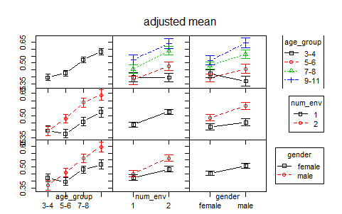

```{r setup, include=FALSE}
#knitr::opts_chunk$set(fig.retina=2)
```

```{r packages, echo=FALSE, message=FALSE, warning=FALSE}
library(tidyverse)
library(moderndive)
library(broom)
library(infer)
library(multcomp) # for post-hoc tests
library(ggbeeswarm)
library(car) # for Anova 
library(phia) # for post-hoc tests and plotting
library(janitor)

select <- dplyr::select # deals with the namespace conflict
```

```{r data_load, echo=FALSE, message=FALSE, warning=FALSE}
# create variable to store url
link <- "https://dataverse.harvard.edu/api/access/datafile/2712105"

# read in column names only
sticker_names <- link %>% 
  read_tsv(n_max = 0) %>% # default: col_names = TRUE
  rename(stickersgiven = 'absolutenumberofstickersgiven(Conditions1or3:Outof12;Conditions2or4:Outof30)') %>% 
  names()

# read in data, set column names
stickers <- link %>% 
  read_tsv(skip = 2, col_names = sticker_names) %>% 
  clean_names()

# clean it up a bit
# in class we got errors, so we commented out two lines
stickers_clean <- stickers %>% 
  mutate(num_stickers = case_when(
    number_stickers == 1 ~ 12,
    number_stickers == 2 ~ 30)) %>% 
  filter(!(subject_number == 263)) %>% 
  #mutate(condition = if_else(subject_number == 263, 3L, condition)) %>% 
  #mutate(num_stickers = if_else(subject_number == 263, 30L, num_stickers)) %>% 
  mutate(prop_given = round(stickersgiven / num_stickers, 2)) %>% 
  select(-percent_given_outof100percent, -number_stickers) %>% 
  mutate(giveornot = case_when(
    prop_given == 0 ~ 0,
    prop_given > 0 ~ 1)) 

givers <- stickers_clean %>% 
  filter(giveornot == 1) %>% 
  mutate(age_group = factor(agegroups, labels = c("3-4","5-6","7-8","9-11")), 
         num_env = as.factor(number_envelopes))

```

class: center, middle, inverse

# ANOVA: 2-way
Let's add a second predictor!
---


.pull-left[
]

.pull-left[
]

---
## Being sticker rich

* Children (ages 3–11) 
  * received a small (12, “sticker poor”) or large (30, “sticker rich”) number of stickers, and
  * were then given the opportunity to share their windfall with either one or two anonymous recipients (Dictator Game). 
* Question: Do the number of available resources and/or the number of potential recipients alter the amount a child donates?
---
##Approach
Only “givers” were analyzed:

* Univariate .small[[read: one response/outcome variable]] ANOVA
* investigate the impact of the between-subjects factors .small[[read: all levels of factors are measured from independent samples]] 
  * age (4: 3–4 years, 5–6 years, 7–8 years, 9–11 years), 
  * number of resources (2: 12 or 30 stickers), 
  * number of recipients (2: 1 or 2 anonymous recipients), and 
  * gender (2: female, male) on the 
  * IV = proportion of resources shared.

---
## Adding a second factor

* In-class lab: One-way ANOVA
  * Effect of age-group on proportion given
* Now: Two (or more) _factor_ predictors
* No interaction term (yet)
* Including another IV in our model means the estimate of the effect is interpreted holding the value of the original IV fixed 

???
*Why?? 
  * We have to account for other known effects
  * We may be interested in differntial effects
*You'll see terms like "accounting for" or "adjusted for"

---
class: center, middle
```{r, echo=FALSE, out.height="100%"}
ggplot(givers, aes(x = factor(num_env), y = prop_given, fill = age_group, colour = age_group)) + 
  geom_dotplot(stackdir = "center", binaxis = "y", 
    binwidth = .01, binpositions = "all", stackratio = 1, dotsize = 3, alpha = .5) + 
  stat_summary(fun.y = mean, fun.ymin = mean, 
    fun.ymax = mean, geom = "crossbar", width = 0.75, lwd = .75) + 
  scale_x_discrete(name = "age group") + 
  scale_y_continuous(name = "proportion of stickers given") +
  geom_hline(yintercept = mean(givers$prop_given), lty = "dashed") +
  theme_bw() +
  theme(legend.position = "none") +
  facet_wrap(~ age_group)
```

---
##Proportions given; by age and number of recipients 
.left-plot[
```{r, echo=FALSE,message=FALSE, error=FALSE, fig.dim=c(4.8, 4.5), out.width="100%"}
ggplot(givers, aes(x = age_group, y = prop_given, colour = num_env)) +
  stat_summary(fun.y = mean, geom = "point") + 
  stat_summary(fun.y = mean, geom = "line", linetype = "dashed", aes(group = num_env)) +
  stat_summary(fun.data = mean_cl_boot, geom = "errorbar", width = 0.2) + 
  labs(x = "Age Group", 
       y = "Proportion of stickers given",
       colour = "Number of recipients") +
  theme_bw() +
  theme(legend.position="bottom") +
  coord_cartesian(ylim = c(0, 1))
```
]
.right-text[
.small[**NOTE**: These are the "unadjusted" means plus 95% confidence intervals. Eventually, you'll want to plot means "adjusted" for other factors in the model (aka, predicted marginal means or least squares means), and their standard errors (so the bars will be shorter!)
]]


---
## Two-way Anova in R
```{r two-way}
anova(lm(prop_given ~ age_group + num_env, data = givers))
```
.pull-left[]
.pull-right[.large[Don't try this at home!!]]

---
## But why you say? 
```{r two-way-twice}
anova(lm(prop_given ~ age_group + num_env, data = givers))
anova(lm(prop_given ~ num_env + age_group, data = givers))
```

---
## Because order matters!
```{r two-way-twice2}
anova(lm(prop_given ~ age_group + num_env, data = givers))
anova(lm(prop_given ~ num_env + age_group, data = givers))
```

???
* on unbalanced designs
* especially in R

---
## What is happening here?
Remember, the anova() command as we used it with linear models compared two nested models. That is, the null hypothesis was that the more complicated model was not better than the less complicated model…

```{r}
lm_age <- lm(prop_given ~ age_group, data = givers)
lm_age_env <- lm(prop_given ~ age_group + num_env, data = givers)

anova(lm_age, lm_age_env)
```
--
_Hmmm... This is what we got when we put num_env second!_

???
Comparing the two models!

Instead of specified model vs null (Intercept only) model, now it’s age_group+num_env vs age_group 

That is, How much “better” is the model with envelopes added?

---
## Wait - did lm() do this awful thing?
```{r}
lm(prop_given ~ num_env + age_group, data = givers)$coefficients
lm(prop_given ~ age_group + num_env, data = givers)$coefficients
```

--
 **_Nope._**

???
Recall - the intercept represents the un-specified group


---
##Types of sums of squares

**Don’t bring this up on stack overflow ;)**
* **Type 1**: sequential (order matters) **[this is the default in R!]**
  * This is rarely what you will be interested in if you are not doing a nested models comparison intentionally
* **Type II**: 
  * This type tests for each main effect after the other main effect.
  * Note that no significant interaction is assumed (in other words, you should test for interaction first) and only if AB is not significant, continue with the analysis for main effects).
* **Type III**:
  * This type tests for the presence of a main effect after the other main effect and interaction. 
  * However, it is often not interesting to interpret a main effect if interactions are present (generally speaking, if a significant interaction is present, the main effects should not be further analysed).
  * If the interactions are not significant, type II gives a more powerful test.
  

???
Computing the SS – where oh where do I put my variance?
* SPSS and SAS default to Type III (which some REALLY dislike)
  * SAS defined the Type terms, and they just stuck
* Doesn’t come up in one-way (orthogonal), because there’s only one way to “bin” the SS

* I think I just said, don't use Type III - defer to linear models

---

##Two-way ANOVA in R - the better way
```{r treatment_coding}
library(car)
# Using treatment coding
age_1st_mod <- lm(prop_given ~ age_group + num_env, data = givers) 
env_1st_mod <- lm(prop_given ~ num_env + age_group, data = givers) 
Anova(age_1st_mod, type = 2)
Anova(env_1st_mod, type = 2)
```
.large[Order doesn't matter!]

???
* Package “car”= companion to applied regression
* Capital A! Anova - can set the Type of SS

* Treatment coding 
* offsets from base groups (age_group 1 and env_1)


---

##Two-way ANOVA in R - Contrast Coding
```{r contrast_coding}
# Contrast coding - sum to 0
sticker_mod <- lm(prop_given ~ age_group + num_env, data = givers, 
		contrasts = list(age_group = contr.sum, num_env = contr.sum))
Anova(sticker_mod, type = 2)
summary(sticker_mod)$coefficients
```

???
Contrasts = contrast coding for unordered factors ( using a “sum to 0” ) 
* for ordered factors, use contr.poly
* Versus the grand mean!


---
class:center, middle
# Computing the Grand Mean

$GrandMean =\ "mean\ of\ means"$

$GrandMean = \frac{\sum_1^j\sum_1^k \mu_{jk}}{j*k}$

$j = Number\ of\ groups\ in\ IV_2$

$k = Number\ of\ groups\ in\ IV_1$


---
##In R - Grand Mean
.left-code[
```{r grand_mean_results, echo=FALSE}
givers %>% 
  group_by(age_group) %>% 
  summarize(age_means = mean(prop_given))

givers %>% 
  group_by(num_env) %>% 
  summarize(env_means = mean(prop_given))

givers %>% 
  group_by(age_group,num_env) %>% 
  summarize(mean_age_env = mean(prop_given)) %>% 
  summarize(mean_age = mean(mean_age_env)) %>% 
  summarize(grand_mean = mean(mean_age))

```
]

.right-plot[
```{r grand_mean_code, eval=FALSE}
givers %>% 
  group_by(age_group) %>% 
  summarize(age_means = mean(prop_given))

givers %>% 
  group_by(num_env) %>% 
  summarize(env_means = mean(prop_given))

givers %>% 
  group_by(age_group,num_env) %>% 
  summarize(mean_age_env = mean(prop_given)) %>% 
  summarize(mean_age = mean(mean_age_env)) %>% 
  summarize(grand_mean = mean(mean_age))
```
]

---
##Checking the coefficients

.tiny[ignore the rounding ;)]
```{r}
round(coef(sticker_mod),3)
```
.pull-left[
$\beta_0 = GrandMean$

$\beta_1 = \mu1-\beta_0$

$\beta_2 = \mu2-\beta_0$

$\beta_3 = \mu3-\beta_0$

$\mu_4 = \beta_0 -(\beta_1 + \beta_2 +\beta_3)$

$num\_env1 = \beta_0 + \beta_4$

$num\_env2 = \beta_0 - \beta_4$

]
.pull-right[
```{r, echo=FALSE}
givers %>% 
  group_by(age_group) %>% 
  summarize(age_means = mean(prop_given))

givers %>% 
  group_by(num_env) %>% 
  summarize(env_means = mean(prop_given))

givers %>% 
  group_by(age_group,num_env) %>% 
  summarize(mean_age_env = mean(prop_given)) %>% 
  summarize(mean_age = mean(mean_age_env)) %>% 
  summarize(grand_mean = mean(mean_age))

```
]

---
#PHIA - Adjusted Means
```{r phia-2way}
plot(interactionMeans(sticker_mod))
```

???
Post-hoc Inference for ANOVA
* Bars show SEM
* Adjusted means (adjusted to account for effect of other group)
* "fitted" sort of...Plug the mean of the other group into the linear model equation
* All seem to be increasing

* Upper Left - Main effect of Age
  * Means by age group after adjusting for number of envelopes

* Lower Right - Main effect of Env
  * Means by number of envelopes after adjusting for age group

* Upper right and lower left
  * What the model thinks is happening
  
**!! Parallel by design!!**
* Need to check for interactions 

---
##Checking for interactions
```{r}
sticker_mod2 <- lm(prop_given ~ age_group * num_env, 
                  data = givers, 
		contrasts = list(age_group = contr.sum, 
		                 num_env = contr.sum))
Anova(sticker_mod2, type = 2)
```

--
*Interaction is not significant. That makes it easier!*

???
* Good news! Independent effects of the IV
* How would you interpret it if it were significant?

---
##Checking for interactions - plot
```{r}
plot(interactionMeans(sticker_mod2))
```

???
* Not signf, just for illustration
* allowes a different effect of x at avery level of y 


---
## Interaction term and interpretation
* Including an interaction changes the interpretation of coefficients for main effects
* The coefficient on the constitutive term X cannot be interpreted as an unconditional marginal effect since it indicates only the effect of a one-unit change in X on Y when the conditioning variable is zero. 
* If the modifying variable is dichotomous, this simply requires the analyst to present four numbers—the marginal effect of X when Z is 0 and when Z is 1, along with the two corresponding standard errors.

???
* E.g., you can't interpret it because it keeps changing
* Isn’t really a “main effect” because it varies based on some other variable.
* Have to say , “but”, or “depends on”

* **The effect of age on proportion of stickers given depends on (varies with) the value of num_envelopes**
* Back to the results

---
## Interpreting the results
```{r}
sticker_mod2 <- lm(prop_given ~ age_group * num_env, 
                  data = givers, 
		contrasts = list(age_group = contr.sum, 
		                 num_env = contr.sum))
Anova(sticker_mod2, type = 2)
```
.small[
Using the interaction model
* Type II (only needed when there is more than one DV)
* Signigicant main effect of age group means that the mean proportion given varied by group
* Signigicant main effect of number of envelopes means that the mean proportion given differs based on number
* No interaction means the effect of one DV does not depend on the other
]
---
## Interpreting the effect of number of recipients
.pull-left[
```{r, echo=FALSE}
plot(interactionMeans(sticker_mod2))
```
]
.pull-right[
* No need!
* Only two levels, so F = 15.02 tells us that that proportion of stickers given was different when there was 1 vs. 2 recipients
* Plots/adjusted means tell us: 2 recipients > 1 recipient (p = 0.0001)
* Note: if you did do a t-test, t = √F = 3.87
]

---
## Interpretting the effect of age group
.pull-left[
```{r, echo=FALSE}
plot(interactionMeans(sticker_mod2))
```
]
.pull-right[
* F = 12.37 tells us that that proportion of stickers given differed depending on age group
* But which age groups were different?
* Need post-hoc analysis if you want to know
]

---
# Follow-up contrasts: multcomp()?
library(multcomp)

>The mcp function must be used with care when defining parameters of interest in two-way ANOVA or ANCOVA models. Here, the definition of treatment differences (such as Tukey’s all-pair comparisons or Dunnett’s comparison with a control) might be problem specific. Because it is impossible to determine the parameters of interest automatically in this case, mcp in multcomp version 1.0-0 and higher generates comparisons for the main effects only, ignoring covariates and interactions (older versions automatically averaged over interaction terms). 

*A warning is given. 

???
Interactions Ignored!!

Goodbye old friend!


---
##Follow-up contrasts: phia?
```{r}
# library(phia)
interactionMeans(sticker_mod2, factors = "age_group")
```

???
* Adjusted for variable we're not seeing
* Saw these in the plots


---
##Follow-up contrasts: phia?
```{r}
# library(phia)
testInteractions(sticker_mod2, pairwise = "age_group")
```

???
* Default adjustment = holms
* Better than t-tests - DF=323


---
class: center, middle, inverse
#Let's try 3 predictors!


---
##ANOVA: 3-way
```{r, echo=FALSE}
givers <- givers %>% 
  mutate(gender = factor(gender, labels = c("na","female","male","na")))

givers <- givers %>%
  filter(gender != "na") %>% 
  droplevels()

sticker_gender <- lm(prop_given ~ age_group * num_env * gender, 
                  data = givers,
		contrasts = list(age_group = contr.sum, 
		                 num_env = contr.sum
		                 ))
Anova(sticker_gender, type = 2)
```

???
* There’s an interaction! Env still easy – no interactions.
 * Thanks for no 3-way interaction. 
 * Think about what this might mean before you start the analyses.


---
#Principle of Marginality
* The separate partial effects, or _main effects_, of age group and gender are _marginal_ to the age group-by-gender interaction. 
* In general, we neither test nor interpret main effects of explanatory variables that interact.
  * If we can rule out interaction either on theoretical or empirical grounds, then we can proceed to test, estimate, and interpret main effects. 
* It does not generally make sense to specify and fit models that include interaction regressors but that delete main effects that are marginal to them.
  * Such models — which violate the _principle of marginality_ — are interpretable, but they are not broadly applicable. 
* ?Anova: “Type-II tests are calculated according to the principle of marginality, testing each term after all others, except ignoring the term's higher-order relatives; so-called type-III tests violate marginality, testing each term in the model after all of the others.”

???
* “Higher order effects” = interactions
* But, kinda stuck with III, aren’t we?


---
```{r, echo=FALSE,message=FALSE, error=FALSE}
ggplot(givers, aes(x = age_group, y = prop_given, colour = num_env)) +
  stat_summary(fun.y = mean, geom = "point") + 
  stat_summary(fun.y = mean, geom = "line", linetype = "dashed", aes(group = num_env)) +
  stat_summary(fun.data = mean_cl_boot, geom = "errorbar", width = 0.2) + 
  labs(x = "Age Group", 
       y = "Proportion of stickers given",
       colour = "Number of recipients") +
  theme_bw() +
  theme(legend.position="bottom") +
  coord_cartesian(ylim = c(0, 1)) +
  facet_wrap(~gender)
```
???
* Seems like age effects boys more than girls
* The effect of gender on sticker generosity changes with age and vice versa


---
class: center, middle
##PHIA - Adjusted means matrix
```{r  out.width = "120%", echo=FALSE}
library(knitr)
 
```

???
* Lower left and Upper right
* Appears that there is an effect of gender by age group, but less so for girls
* Does it matter?


---
#Adjusted interaction means
```{r}
interactionMeans(sticker_gender)
```

???

numbers for previous plot


---
#Simple effects analysis
* A simple effects analysis looks at the main effect of one factor at a given level of a second factor (“pick a point” analysis)
* This is our way of breaking down a significant interaction
* It *can* be frowned upon to do this analysis post-hoc when you do not have a significant interaction effect in your omnibus ANOVA, or did not have a darn good reason to hypothesize one a-priori


???
NO fishing allowed.


---
##Drilling down - Do the age groups differ across gender?
```{r}
# library(phia)
testInteractions(sticker_gender, 
                 fixed = "age_group", 
                 across = "gender", 
                 adjustment = "bonferroni")
```
* Boys shared 12.6% more stickers than girls on average, at age 9-11.
* Where does this come from?

???
* Fix age group - vary gender, don't cheat!
* Using subtraction - so negative means more
* Diff between girls and boys is biggest for the 9-11 year olds


---
## Compute that difference...
```{r}
#Save the means
int_means <- interactionMeans(sticker_gender)
int_means$means <- int_means$"adjusted mean" #rename "adjusted mean"

# Pull out the values for age group 9-11
# Average across num_env = 1 and num_env = 2
# And look at the difference
int_means %>%
  filter(age_group == "9-11") %>% 
  group_by(gender) %>% 
  summarize(adj_mean = mean(means))
```


---
## Drilling down - How about gender across age group?
```{r}
# library(phia)
testInteractions(sticker_gender, 
                 fixed = "gender", 
                 across = "age_group", 
                 adjustment = "bonferroni")
```


* Appears to be an effect of gender independent of age_group
* Boys more than girls

???
Details next...

---
## Compare age groups by gender
```{r}
# library(phia)
testInteractions(sticker_gender, 
                 pairwise = "age_group", 
                 fixed = "gender", 
                 adjustment = "bonferroni")
```

???
There it is! Definitely more attributable to boys


---
#What do we conclude?
* Overall, model accounted for 11.2% of variance in proportion of stickers donated
* Main effect: proportion of stickers donated depended on number of envelopes
* Kids tended to share more proportionally when they thought there were 2 recipients rather than just 1
* Interaction effect: suggested that…
  * Boys shared proportionally more than girls, but only in the oldest age group (age_group = 4)
  * For boys only, increased sharing at older ages, but only between certain age groups: 1 vs 3, 1 vs 4, and 2 vs 4


---
class: center, middle, inverse
# ANCOVA
## Add an interval (continuous) variable

---
##ANCOVA
* Compare more than two groups along with a _covariate_
* Assumes homogeneity of regression slopes
  * Means using a variable as a covariate (+) rather than letting it interact with other variables (*) 
  * Must be verified that they do NOT interact
* If the variable you want to be the covariate interacts with your other predictor(s), 
  * You cannot do an ANCOVA, by definition. 
  * But that might be okay.. (use ANOVA or a linear regression model instead)

???
* Really a linear regression
* Like when we compared hate_crimes across the two "trump" groups 


---
# Let's try it...
* Let’s take age as a continuous variable (in months) rather than as a factor with 4 levels

```{r}
sticker_spot <- lm(prop_given ~ agemonths*gender*num_env, 
                   data = givers, 
                   contrasts = list(gender = contr.sum, 
                                    num_env = contr.sum))
Anova(sticker_spot, type = 2)
```

???
* Interpretation? Kinda rough with the interactions
* Woah - can't call it an ANCOVA!!
* Can move on anyway... Just call it an anova 


---
#Spotlight analysis to understand interactions
>“scaling changes do not affect significance tests, slopes, etc. of that variable or of any other variable in the model.”

* Yes, this heuristic is accurate for simple models without interactions, *but not for models with interactions*.
* Spotlight analysis exploits this fact by re-scaling your continuous covariate (here, age in months)
* We want to evaluate main effect of gender when age takes on different values- the interaction tells us that the main effect of gender depends on the age we are looking at
* We can pick any value to re-scale by
  * First, I’ll center age around the mean age
  * Can also use ±1 SD around the mean (usually of interest)


---
##Spotlight - mean age
```{r}
# center age at mean
givers <- givers %>%
  mutate(age_mean = agemonths - mean(agemonths))
sticker_ctr <- lm(prop_given ~ age_mean*gender*num_env, 
                  data = givers, 
                  contrasts = list(gender = contr.treatment, 
                                   num_env = contr.treatment))
tidy(sticker_ctr)
```

Shine our spotlight on the gender effect:
  * It is not significant when age = mean age
  * So sharing in boys is: 0.02 > girls(ns) @ 81 months (6.7 years) when *num_env = 1*

???
* Need to use dummy/treatment coding for spotlight analysis
* and tidy() or summary()
* Using centered(age)

* What's the intercept?? girl, mean age, 1 envelope 


---
##Spotlight - low age (-1 sd)
```{r}
# center at 1 sd below mean
givers <- givers %>%
     mutate(age_lowsd = scale(agemonths, scale=FALSE) - sd(agemonths))
sticker_lowsd <- lm(prop_given ~ age_lowsd*gender*num_env, 
                    data = givers, 
                    contrasts = list(gender = contr.treatment, 
                                     num_env = contr.treatment))
tidy(sticker_lowsd)
```

Shine our spotlight on the gender effect:
  * It is significant when age is one sd above mean 
  * So sharing in boys is: 0.05 > girls(ns) @ 53 months (4.5 years) when *num_env = 1*

???
Using centerd age minus 1 sd


---
##Spotlight - high age (+1 sd)
```{r}
# center at 1 sd above mean
givers <- givers %>%
     mutate(age_hisd = scale(agemonths,scale=FALSE) + sd(agemonths))
sticker_hisd <- lm(prop_given ~ age_hisd*gender*num_env, 
                   data = givers, 
                   contrasts = list(gender = contr.treatment, 
                                    num_env = contr.treatment))
tidy(sticker_hisd)
```

Shine our spotlight on the gender effect:
  * It is significant when age is one sd above mean 
  * So sharing in boys is: 0.009 < girls(p<.05) @ 108 months (9.0 years) when *num_env = 1*

???


---
#Cautionary note on spotlight analysis
* Unless you are using them as a classification variable (i.e., they are not being used as actual numbers), dummy codes are only useful if you are planning to spotlight 1 group in an interaction 
* Otherwise, all of your purported “main effects” are actually the effects of a variable at one level of the other (i.e., when the other is 0). 
* Caution: if there are other variables in your model, recall that the main effect when dummy coded is just a marginal effect where the other variables are set to lowest level (here, num_env = 1)


**They are called dummy codes for a reason. That is, you may not be testing what you think you are testing.**


---
class: center middle
##What about when num_env = 2? 

The spotlight method works best for a two-way analysis with two factors or one factor and one continuous variable. 


What we really want to know is how the interaction between age and gender can be interpreted, averaging across number of envelopes (since that does not contribute to any interactions with other model predictors). 


There has to be a better way…


---
## There is!
Using the model with contr.sum() coding
```{r, warning=FALSE}
interactionMeans(sticker_spot, factors = "gender", covariates = c(agemonths = 53.57))
interactionMeans(sticker_spot, factors = "gender", covariates = c(agemonths = 80.98))
interactionMeans(sticker_spot, factors = "gender", covariates = c(agemonths = 108.39))
```

* Averaged across number of envelopes!


---
```{r, message=FALSE}
testInteractions(sticker_spot, pairwise = "gender", covariates = c(agemonths = 53.57), adjustment = "none") # at -1 sd
testInteractions(sticker_spot, pairwise = "gender", covariates = c(agemonths = 80.98), adjustment = "none") # at mean
testInteractions(sticker_spot, pairwise = "gender", covariates = c(agemonths = 108.39), adjustment = "none") # at +1 sd
```

???
Complete unsurprising


---
##Spotlight analysis summary
* Great way to understand interactions with continuous covariates; also works for factors
* Powerful way to see what is happening without subsetting your data
    * i.e., splitting by above/below mean/median/etc can be weak, unstable, potentially very misleading
* This is not multiple testing- 
    * you do not need to worry about multiple comparisons here- 
    * it is used to interpret an already significant interaction
* So don’t report them as if you ran different analyses with different results


